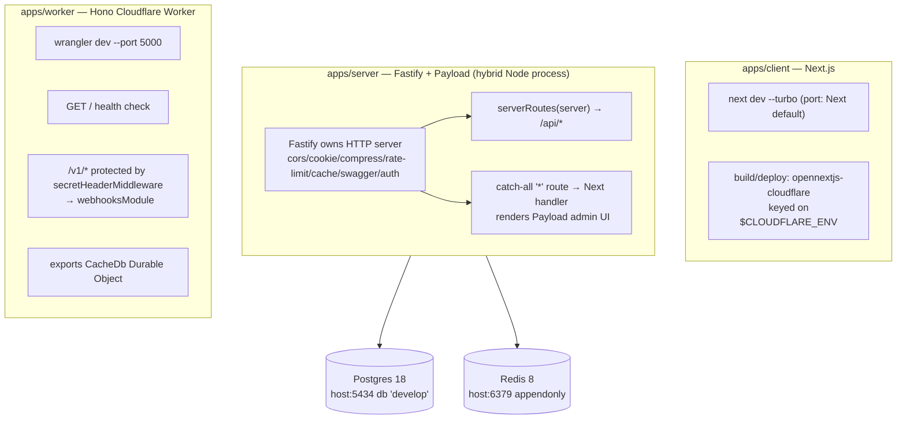

# Architecture

## Purpose

This repo is a **co-located three-app monorepo** under `apps/`: a Next.js **client**, a Fastify + Payload CMS **server**, and a Hono **Cloudflare Worker**. All three share one Feature-Sliced Design (Layer/Slice/Segment) source layout and are orchestrated by a root `Makefile` plus a Docker Compose Postgres/Redis stack in `infra/`.

## What it is (in this repo)

There is **no root `package.json` and no Yarn-workspace wiring**. "Monorepo" here means three self-contained apps that happen to live in the same git repo and pin identical tooling. Each app has its own `package.json`, `.env(.example)`, `tsconfig`, ESLint/Prettier config, and is installed/run with its own `yarn install` / `yarn dev`. The glue is the `Makefile` (`/Users/cbv/Documents/Work-app/rl-apps-template/Makefile`), which simply `cd`s into each app:

```
apps/
  client/   Next.js 15 + React 19 UI       → Cloudflare via @opennextjs/cloudflare   ([[client-app]])
  server/   Fastify 5 + Payload CMS 3       → long-lived Node process                 ([[server-app]], [[payload-cms]])
  worker/   Hono 4 + Cloudflare Worker      → wrangler ("paynext-microservice")        ([[worker-app]])
infra/
  docker-compose.yml   Postgres 18 + Redis 8 (shared local infra)
Makefile               docker-up, copy-env, install-deps, {client,server,worker}-dev
```

All three apps pin **Node 22** and **`yarn@1.22.22`** (via `packageManager` and a `volta` block — `node 22.22.0`, `yarn 1.22.22` — in all three `package.json`s; the client's `engines.node` is `22.x`, server and worker use `>=22`). See [[build-and-deploy]] for the bootstrap flow and per-app deploy targets.

## How it works — the shared FSD layout

Every app's `src/` follows the same vocabulary. Domain code lives under `src/app/` as FSD layers, with two cross-cutting layers (`src/config`, `src/pkg`) hoisted to the `src/` root:

```
src/
  app/          FSD layers (see per-app pages for which exist)
    modules/    feature compositions / route groups
    widgets/    composite UI / wiring (near-empty in worker)
    features/   client + server only
    entities/   domain models & schemas
    shared/     leaf utilities, constants, services
    ...         (client: route groups; server: routes/, (payload)/)
  config/       env/runtime config — see [[client-config]], [[server-config-shared]]
  pkg/          framework integrations — see [[client-pkg]], [[server-pkg]]
```

What differs per app (all verified on disk):

- **Client** (`apps/client/src/app/`): FSD layers `modules, widgets, features, entities, shared` **plus** Next App Router route groups. Localized pages live under `app/(web)/[locale]/` with nested `(auth)`, `(public)`, `(protected)` groups, a root `layout.tsx`, `global-error.tsx`, `robots.ts`, and a top-level `src/middleware.ts`. i18n is wired in `next.config.ts` via `next-intl` pointing at `src/pkg/locale/request.ts`. See [[client-routing]], [[client-modules-widgets]], [[client-shared]].
- **Server** (`apps/server/src/app/`): FSD layers `modules, widget, features, entities, shared` **plus** `routes/` (Fastify route registration) and the Payload route group `app/(payload)/{admin, api, [[...segments]], migrations}`. See [[server-modules]], [[server-collections]], [[server-features-blocks]].
- **Worker** (`apps/worker/src/app/`): FSD layers `modules, widgets, entities, shared` (no `features`). Concretely populated: `modules/webhooks/` (`webhooks.module.ts` + `webhooks.service.ts`), `entities/{models/cache-db.object.ts, schemas/webhook.schema.ts}`, `pkg/{middleware, validator}`. `widgets/` and `shared/` are mostly empty barrel/index files — the worker FSD tree is scaffolded more than populated. See [[worker-app]] and [[worker-modules]].

FSD conventions and the skills that enforce them are documented in [[conventions-and-skills]].

## How it works — per-app process model

The three apps have genuinely different runtimes:



Notable specifics, file-referenced:

- **Server is a hybrid process.** `apps/server/src/server.ts` boots Fastify (lines 36–55: `cors`, `cookie`, `compress`, `rate-limit`, `fastify-cacheman` over Redis, graceful-shutdown, swagger in non-prod, `authPlugin`), registers `serverRoutes(server)`, then (lines 60–87) registers a catch-all `*` route that hijacks the reply and forwards to a Next.js request handler (`admin.getRequestHandler()`), which renders the Payload admin. Fastify owns the socket; Next is mounted inside it. See [[server-app]] and [[payload-cms]].
- **Worker** (`apps/worker/src/app/server.ts`): a `Hono<{ Bindings: CloudflareBindings }>` app with global `logger()`, `cors`, `timeout(60000)`; health check at `GET /`; `app.use('/v1/*', secretHeaderMiddleware)` then `app.route('/v1', webhooksModule)`; `notFound`/`onError` handlers. It **re-exports the `CacheDb` Durable Object** (`export { CacheDb } from './entities/models'`, line 9). See [[worker-app]] and [[worker-modules]].
- **Client** deploys to Cloudflare via `@opennextjs/cloudflare` (`deploy`/`preview` scripts keyed on `$CLOUDFLARE_ENV`); dev is plain `next dev --turbo`. See [[build-and-deploy]].

## Shared infrastructure

`infra/docker-compose.yml` (compose project `apps-containers`) provides:

- **`postgres-local`** — `postgres:18`, host `5434` → container `5432`, db `develop`, user `postgres`. Backs the server's Payload DB. See [[database-and-migrations]].
- **`redis-local`** — `redis:8`, host `6379`, `--appendonly yes`. Backs the server's `fastify-cacheman` cache (`redisCache` in `apps/server/src/server.ts`).

Only the **server** consumes this infra; the worker uses a Durable Object (`CacheDb`, see [[worker-modules]]) for its caching/state, and the client is stateless at the edge.

## Auth & data flow

`better-auth` appears in **both** the client (`apps/client/package.json`) and server (`apps/server/package.json` → `authPlugin` in `pkg/auth`); see [[auth]]. For how a request travels client → server/worker → Postgres/Redis, see [[data-flow]].

## Depends on / talks to

- [[client-app]] · [[client-routing]] · [[client-modules-widgets]] · [[client-shared]] · [[client-pkg]] · [[client-config]]
- [[server-app]] · [[payload-cms]] · [[server-collections]] · [[server-features-blocks]] · [[server-modules]] · [[server-pkg]] · [[server-config-shared]]
- [[worker-app]] · [[worker-modules]]
- [[build-and-deploy]] · [[database-and-migrations]] · [[auth]] · [[data-flow]] · [[conventions-and-skills]] · [[index]]

## Discrepancies (read before trusting docs)

- **`.claude/CLAUDE.md` carries no architecture.** It now holds only general engineering guidelines (think before coding, simplicity, surgical changes, goal-driven execution, verify before done) — no repo description, no commands, no hard rules, and no mention of the three apps. The repo's architecture and governance live in `README.md` and the structure skills (`client-structure`, `server-structure`, `worker-structure`, plus `git-workflow`) under `.claude/skills/`; see [[conventions-and-skills]]. The repo root holds only `Makefile`, `README.md`, `apps/`, `infra/` — there is no top-level `src/`.
- **README.md and the Makefile are correct**, including the `worker` app and `make worker-dev` — `apps/worker` exists with a full FSD `src/` tree, `wrangler.jsonc`, and the `paynext-microservice` Hono package.
- **"Monorepo" is co-location only** — no root `package.json` / Yarn workspace was found; orchestration is purely the `Makefile` `cd`-ing into each app.
