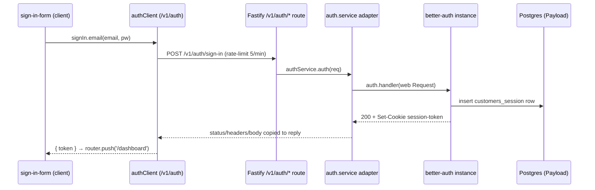

# Auth

## Purpose

End-to-end authentication built on **better-auth**, spanning the Next.js client (sign-in/sign-up UI + session reads) and the Fastify server (a single better-auth instance proxied through a catch-all route). Session/user/account state is persisted in **Payload-managed Postgres collections** (`customers`, `customers_session`, `account`, `verification`). Email + password is the only working flow today; social login is a stub.

## How it works in this repo

### One better-auth instance (server `pkg`)

The whole auth surface is one `betterAuth(...)` object in [apps/server/src/pkg/auth/auth.service.ts](../../apps/server/src/pkg/auth/auth.service.ts). It is configured with:

- A node-postgres `Pool` built from `envConfig.DATABASE_URI` (SSL `rejectUnauthorized: false` only in production), spread with `dbConfig`.
- `baseURL = ${envConfig.SERVER_BASE_URL}/v1/auth`, `secret = envConfig.JWT_SECRET`, `trustedOrigins` split from `envConfig.CORS_ORIGIN`.
- `emailAndPassword.enabled = true` with `minPasswordLength: 8` / `maxPasswordLength: 20`.
- Brute-force guard: `maxLoginAttempts: 5`, `lockTime: 600 * 1000` (600s).
- Sessions: `expiresIn` 7 days, `updateAge` 1 day, with a **JWT-strategy cookie cache** (`session.cookieCache.strategy: 'jwt'`).
- `advanced.database.generateId: 'uuid'`; cookies default to `httpOnly + secure + sameSite:'lax'`; the session cookie is **renamed to `session-token`** via `advanced.cookies.session_token.name`.
- Cross-subdomain cookies are added only when `envConfig.SERVER_SUBDOMAIN` is set, and even then `enabled` only in production.
- Plugins: `bearer()` and `openAPI()`.

**Explicit model/field mapping onto Payload collections** is the load-bearing detail — better-auth's default model names are remapped:

```
session → modelName 'customers_session'  (expiresAt→expires_at, userId→user_id, …)
user    → modelName 'customers'          (emailVerified→email_verified, …) + changeEmail.enabled
account → modelName 'account'            (accessToken→access_token, idToken→id_token, …)
```

Note: the `account.fields` map does not remap `scope`, `idToken`'s sibling `password`, etc. to snake_case — `scope` and `password` are passed through as-is while `idToken→id_token` is mapped. The `verification` collection has no `fields` override at all in `auth.service.ts`. (Field-naming drift here is a thing to watch if you alter the collections.)

### Catch-all route + adapter (server `app/modules`)

The HTTP surface is registered in [apps/server/src/app/modules/auth/auth.module.ts](../../apps/server/src/app/modules/auth/auth.module.ts):

- A single `server.route` matching **all verbs** (`GET/POST/PUT/DELETE/PATCH/HEAD`) on `url: '/auth/*'`, `schema: { hide: true }`.
- Per-path rate limits via `config.rateLimit.max`: `/auth/sign-in` → 5, `/auth/sign-up` → 3, everything else → 60, all over `timeWindow: '1 minute'`.
- The handler delegates to `authService.auth(server, request, reply)`.

[apps/server/src/app/modules/auth/auth.service.ts](../../apps/server/src/app/modules/auth/auth.service.ts) is the Fastify↔better-auth bridge: it rebuilds a web `Request` (URL from `request.headers.host`, copied headers, JSON-stringified body), calls `auth.handler(req)`, then copies `response.status`, every response header, and the body text back onto the Fastify reply.

This module is registered under the `/v1` prefix as "private routes" in [apps/server/src/app/routes/server.routes.ts](../../apps/server/src/app/routes/server.routes.ts), so the effective base is `/v1/auth/*` — matching the instance's `baseURL`.

### The `authenticate` guard (server `pkg`)

[apps/server/src/pkg/auth/auth.plugin.ts](../../apps/server/src/pkg/auth/auth.plugin.ts) is a `fastify-plugin` that decorates the instance with `fastify.authenticate`, a preHandler that:

1. Reads `request.cookies[SECURE_COOKIE_NAME] || request.cookies[COOKIE_NAME]` → `401` if absent.
2. Calls `auth.api.getSession({ headers })` → `401` if no session.
3. On success, sets `request.session` / `request.user`; any throw → `500`.

Cookie names live in [apps/server/src/pkg/auth/auth.constant.ts](../../apps/server/src/pkg/auth/auth.constant.ts) (`COOKIE_NAME = 'session-token'`, `SECURE_COOKIE_NAME = '__Secure-session-token'`). The Fastify type augmentation (`authenticate` on `FastifyInstance`, optional `session`/`user` on `FastifyRequest`) is in [apps/server/src/pkg/auth/auth.interface.ts](../../apps/server/src/pkg/auth/auth.interface.ts). The plugin is registered globally in [apps/server/src/server.ts](../../apps/server/src/server.ts) (line 50: `server.register(authPlugin)`), so any route can opt in with `{ preHandler: fastify.authenticate }`. The slice is re-exported via [apps/server/src/pkg/auth/index.ts](../../apps/server/src/pkg/auth/index.ts).

### Persistence (server collections / Payload)

Four Payload `CollectionConfig`s back the auth schema, all under the admin `Profile` group:

- [customer.collection.ts](../../apps/server/src/app/entities/collections/auth/customer.collection.ts) — slug `customers` (better-auth user): `name`, `email` (unique), `image`, `emailVerified`; `useAsTitle: 'name'`, visible.
- [customer-session.collection.ts](../../apps/server/src/app/entities/collections/auth/customer-session.collection.ts) — slug `customers_session`: `userId`, `token`, `expiresAt`, `ipAddress`, `userAgent`; `admin.hidden`.
- [account.collection.ts](../../apps/server/src/app/entities/collections/auth/account.collection.ts) — slug `account`: `userId`, `accountId`, `providerId`, access/refresh tokens + expiries, `scope`, `idToken`, `password`; `admin.hidden`.
- [verification.collection.ts](../../apps/server/src/app/entities/collections/auth/verification.collection.ts) — slug `verification`: `identifier`, `value`, `expiresAt`, `ipAddress`, `userAgent`; `admin.hidden`.

They are barreled in [auth/index.ts](../../apps/server/src/app/entities/collections/auth/index.ts) and wired into `payload.config.ts` through the collections registry. See [[server-collections]] and [[payload-cms]].

### Client side

- **Browser client**: [apps/client/src/pkg/auth/client/auth.client.ts](../../apps/client/src/pkg/auth/client/auth.client.ts) — `createAuthClient` from `better-auth/react`, `baseURL = ${NEXT_PUBLIC_CLIENT_API_URL}/v1/auth`. Exported as `authClient`.
- **Server helpers**: [apps/client/src/pkg/auth/server/auth.server.ts](../../apps/client/src/pkg/auth/server/auth.server.ts) (`'server-only'`) — `getSession()` fetches the get-session endpoint forwarding incoming `headers()`; `getCacheSession()` reads the `better-auth.session_data` / `__Secure-better-auth.session_data` cookie and `jwtVerify`s it locally with `envServer.JWT_SECRET` (jose). Both return `{ user: null, session: null }` on failure.
- **Forms** (under `app/modules/sign`): [sign-in-form.component.tsx](../../apps/client/src/app/modules/sign/elements/sign-in-form.component.tsx) calls `authClient.signIn.email`, routes to `/dashboard` on `res?.token`; [sign-up-form.component.tsx](../../apps/client/src/app/modules/sign/elements/sign-up-form.component.tsx) calls `authClient.signUp.email` with the same 8–20 char rule; [social-form.component.tsx](../../apps/client/src/app/modules/sign/elements/social-form.component.tsx) is a Google button whose `onSubmit` only `console.log`s (not wired). [sign.component.tsx](../../apps/client/src/app/modules/sign/sign.component.tsx) switches on a `variant` prop. See [[client-modules-widgets]].
- **Routing/protection**: [apps/client/src/middleware.ts](../../apps/client/src/middleware.ts) gates `/dashboard` ↔ `/sign-in` via `authServer.getSession()`; the `(protected)/layout.tsx` is a passthrough and the dashboard page reads `data.user?.email` directly. See [[client-routing]].

### Login trace



## Where it lives

```
apps/server/src/pkg/auth/                          # instance, plugin, constants, interface (pkg slice)
apps/server/src/app/modules/auth/                  # catch-all route + Fastify↔better-auth adapter
apps/server/src/app/entities/collections/auth/     # 4 Payload collections
apps/client/src/pkg/auth/{client,server}/          # browser client + server-only session helpers
apps/client/src/app/modules/sign/                  # sign-in/up/social UI
apps/client/src/middleware.ts                      # route gating
```

## Discrepancies / unverified

- **Get-session base-URL mismatch**: `authClient` uses `${NEXT_PUBLIC_CLIENT_API_URL}/v1/auth`, but `authServer.getSession()` fetches `${NEXT_PUBLIC_CLIENT_API_URL}/api/v1/auth/get-session` — an extra `/api/` segment. No rewrite config was found to reconcile these; could be intentional proxying or a latent bug. (unverified)
- **Truthy-session guard**: `getSession()` always resolves to an object (even `{ user: null, session: null }` on failure), yet `middleware.ts` does `if (!session)`. A non-null object is always truthy, so the `/dashboard` redirect likely never fires through this path and `/sign-in` may redirect unconditionally. The dashboard page itself uses `data.user?.email`, which degrades gracefully. Not runtime-verified, but the code shape strongly suggests the guard is ineffective. (unverified)
- **`getCacheSession()` appears unused** — no consumer found in the client app; only `getSession` is referenced by middleware and the dashboard page. Possibly dead/future code. (unverified)
- **Social login is a placeholder** — `social-form.component.tsx` only logs, and no social provider is configured on the better-auth instance.
- **Field-mapping gaps** in `auth.service.ts`: `verification` has no `fields` override, and `account`'s `scope`/`password` are not remapped to snake_case while other fields are — review before changing collection schemas. (unverified impact)

## Depends on / talks to

[[server-pkg]] · [[server-modules]] · [[server-app]] · [[server-collections]] · [[payload-cms]] · [[database-and-migrations]] · [[server-config-shared]] · [[client-pkg]] · [[client-modules-widgets]] · [[client-routing]] · [[client-config]] · [[data-flow]] · [[architecture]] · [[index]]
