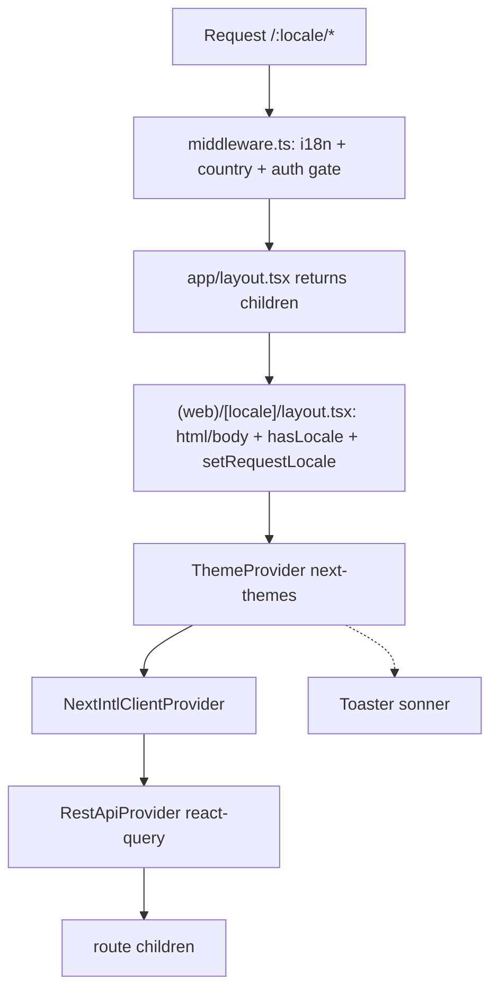

# Client App

## Purpose

The entry point and shell of the Next.js 15 App Router client (`apps/client`). It defines the root and per-locale layouts, wires up the global provider stack (theme, react-query, next-intl) plus a toaster, and establishes the Feature-Sliced Design `src/` layout: `app/` (FSD slices + the `(web)/[locale]` route group), `pkg/` (integrations), and `config/` (env, fonts, styles).

## Key files

- `apps/client/src/app/layout.tsx` — Root layout. Intentionally minimal: returns `children` directly with no `<html>`/`<body>`. The document shell lives in the locale layout instead.
- `apps/client/src/app/(web)/[locale]/layout.tsx` — Locale layout. Renders `<html lang>`/`<body>`, validates the locale, sets the request locale, generates static params + metadata, and nests the provider stack.
- `apps/client/src/app/global-error.tsx` — Global error boundary (`'use client'`) rendering its own bare `<html>`/`<body>`; logs the error and links back to `/`.
- `apps/client/src/app/robots.ts` — `robots.txt` route handler. Currently **disallows all crawlers** (`userAgent: '*'`, `disallow: '*'`, with `allow: '/'` commented out).
- `apps/client/src/app/(web)/[locale]/not-found.tsx` — Locale-scoped 404; delegates to `NotFoundComponent` from `@/app/modules/not-found` (see [[client-modules-widgets]]).
- `apps/client/next.config.ts` — Next config wrapped by the next-intl plugin; SVGR for turbopack + webpack, image optimization, cache headers.
- `apps/client/tsconfig.json` — Strict TS, `moduleResolution: bundler`, `jsx: preserve`, `@/*` → `./src/*` path alias, `next` plugin.
- `apps/client/src/middleware.ts` — Edge middleware: i18n routing, country-header detection, auth-gated redirects (see [[client-routing]], [[auth]]).
- `apps/client/src/pkg/theme/theme.provider.tsx`, `apps/client/src/pkg/rest-api/rest-api.provider.tsx` — Provider wrappers (see [[client-pkg]]).
- `apps/client/src/config/fonts/font.ts` — Inter + Montserrat as CSS variables (see [[client-config]]).

## Responsibilities

- **Boots the App Router client** — Next.js `15.5.12`, React `19.2.0` (per `apps/client/package.json`).
- **Two-tier layout split** — the root layout (`app/layout.tsx`) is a pass-through that returns `children`; the locale layout (`app/(web)/[locale]/layout.tsx`) owns the document shell, applying font classNames and `suppressHydrationWarning` on both `<html>` and `<body>`.
- **Wires the global provider stack** in the locale layout, in a fixed nesting order:

```tsx
<ThemeProvider>                      {/* next-themes, attribute=class, defaultTheme=system */}
  <NextIntlClientProvider>           {/* next-intl */}
    <RestApiProvider>{children}</RestApiProvider>  {/* @tanstack/react-query */}
  </NextIntlClientProvider>
  <Toaster position='top-center' duration={3000} />   {/* sonner, sibling of the providers */}
</ThemeProvider>
```

- **Per-locale static generation + metadata** — `generateStaticParams` maps `routing.locales`; `generateMetadata` builds title/description/OpenGraph with `metadataBase = new URL(envClient.NEXT_PUBLIC_CLIENT_WEB_URL)` and `EAssetImage.FAVICON` / `EAssetImage.OG_IMAGE` (from `@/app/shared/interfaces`).
- **Locale validation** — `hasLocale(routing.locales, locale)` → `notFound()` on miss; otherwise `setRequestLocale(locale)`.
- **Global error handling + crawler policy** — `global-error.tsx` (no i18n; renders outside the providers, as expected for a global boundary) and `robots.ts` (disallow-all).
- **next-intl wiring** — both build-time (`createNextIntlPlugin` in `next.config.ts`, `requestConfig: './src/pkg/locale/request.ts'`) and request-time (`NextIntlClientProvider` + `setRequestLocale`).
- **Tooling config** in `next.config.ts` — `poweredByHeader: false`, `expireTime: 604800`, SVGR for turbopack + webpack, image `remotePatterns` (`https://**`, `http://localhost:4000`), `deviceSizes`/`imageSizes`, and a `Cache-Control` header on `/_next/image`.
- **Establishes the FSD `src/` tree** and imports the global stylesheet (`import '@/config/styles/global.css'`), exposing the `@/*` alias.

## FSD layout (verified)

```
apps/client/src/
  app/                       # FSD slices + routes
    layout.tsx               # thin root layout
    global-error.tsx
    robots.ts
    (web)/[locale]/          # route group → layout.tsx, not-found.tsx
    modules/                 # not-found, layout, main, sign …
    widgets/                 # header, footer …
    entities/                # api, models …
    features/
    shared/                  # assets, components, constants, interfaces, store
  pkg/                       # integrations: auth, locale, rest-api, theme
  config/                    # env, fonts, styles
  middleware.ts
```

The slice layers (`modules`, `widgets`, `entities`, `features`, `shared`) are detailed in [[client-modules-widgets]] and [[client-shared]]; `pkg/` in [[client-pkg]]; `config/` in [[client-config]]; routing/route-group in [[client-routing]]. The overall layered convention is described in [[architecture]] and [[conventions-and-skills]].

## Provider request flow



## Notes & verified details

- `request.ts` (`apps/client/src/pkg/locale/request.ts`) loads messages via a relative import `../../../translations/${locale}.json` (resolving to `apps/client/translations/`). The `./translations/en.json` path in `next.config.ts` is the separate build-time `createMessagesDeclaration` target. The `translations/` dir **exists** (`en.json` + generated `en.d.json.ts`) — confirmed, correcting the original uncertainty.
- Locale config (`apps/client/src/pkg/locale/routing.ts`): `locales: ['en']`, `defaultLocale: 'en'`, `localePrefix: 'as-needed'`, `localeDetection: false`.
- `ThemeProvider` also sets `disableTransitionOnChange` (in addition to `attribute='class'`, `defaultTheme='system'`).
- `RestApiProvider` calls `getQueryClient()` from `@/pkg/rest-api/service` and mounts `ReactQueryDevtools initialIsOpen={false}`.
- `robots.ts` disallow-all and `global-error.tsx`'s hardcoded English string are plausibly template/scaffold defaults rather than bugs; neither is documented elsewhere (so the intent is unverified).
- `middleware.ts` short-circuits `/api/*` with `NextResponse.next()` before i18n, sets an `x-country` header + cookie, and gates `/dashboard` (→ `/sign-in` when no session) and `/sign-in` (→ `/dashboard` when session) via `authServer.getSession()`.

## Depends on / talks to

- [[client-routing]] — the `(web)/[locale]` route group, middleware matcher, locale routing.
- [[client-pkg]] — `ThemeProvider`, `RestApiProvider`, locale `routing`/`request`, `auth` integrations consumed by the shell.
- [[client-config]] — `envClient`, fonts, global styles.
- [[client-modules-widgets]] — `NotFoundComponent` and the slice layers under `app/`.
- [[client-shared]] — `EAssetImage` / shared interfaces, assets, store.
- [[auth]] — `authServer.getSession()` redirects in `middleware.ts`.
- [[data-flow]] — react-query provider seeds the client data layer.
- [[build-and-deploy]] — `next.config.ts` build tooling and image/cache settings.
- [[conventions-and-skills]] — FSD layout conventions (`client-structure` skill).
- [[architecture]] · [[index]]
