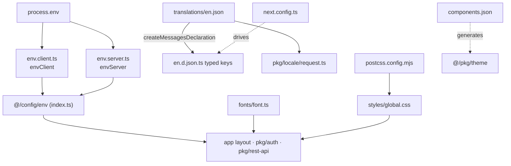

# Client Config

**Purpose** — Centralized client-side configuration for the Next.js app under `apps/client/`: typed/validated environment variables (t3-env, split client vs server), Google fonts as CSS variables, the single global Tailwind v4 stylesheet, the next-intl i18n message catalog with generated typed keys, plus the shadcn/ui generator and PostCSS configs. It is the one place app code reads env and the one place global styling/theme tokens live.

## Key files

- `apps/client/src/config/env/env.client.ts` — t3-env `createEnv` for browser-exposed `NEXT_PUBLIC_*` vars: `NEXT_PUBLIC_CLIENT_WEB_URL`, `NEXT_PUBLIC_CLIENT_API_URL`, both `z.string().nonempty(...)`.
- `apps/client/src/config/env/env.server.ts` — t3-env `createEnv` for server-only vars: `NODE_ENV` (`enum(['development','production']).optional().default('development')`), `JWT_SECRET` (required), `REDIS_URL` (optional).
- `apps/client/src/config/env/index.ts` — barrel re-exporting `envClient` + `envServer`; the single `@/config/env` import surface.
- `apps/client/src/config/fonts/font.ts` — `next/font/google`: `Inter` as `fontPrimary` (variable `--font-primary`), `Montserrat` as `fontSecondary` (variable `--font-secondary`); both `subsets: ['latin']`, `preload: true`, `display: 'swap'`, `adjustFontFallback: false`.
- `apps/client/src/config/fonts/index.ts` — barrel re-exporting `fontPrimary` + `fontSecondary`.
- `apps/client/src/config/styles/global.css` — Tailwind v4 entry: `@import 'tailwindcss'`, `tw-animate-css`, shadcn light/dark CSS-variable palettes, `@theme inline` token mapping, base layer + global element resets.
- `apps/client/translations/en.json` — i18n message catalog (currently only `{ "project_name": "App Template" }`).
- `apps/client/translations/en.d.json.ts` — auto-generated typed message keys (do not edit); produced by the next-intl `createMessagesDeclaration` workflow.
- `apps/client/components.json` — shadcn/ui CLI config: `new-york` style, `rsc: true`, lucide icons, `baseColor: neutral`, aliases into `@/pkg/theme`, extra component registries.
- `apps/client/postcss.config.mjs` — PostCSS config loading only `@tailwindcss/postcss` (Tailwind v4, config-less — there is no `tailwind.config.js`).
- `apps/client/next.config.ts` — wires the next-intl plugin (`requestConfig` path + `experimental.createMessagesDeclaration` generating `en.d.json.ts` from `en.json`).
- `apps/client/src/pkg/locale/request.ts` — next-intl `getRequestConfig`: resolves locale, dynamically imports `translations/{locale}.json`, exports shared `formats`. (Lives in [[client-pkg]] but is the runtime consumer of this catalog.)
- `apps/client/src/pkg/locale/routing.ts` — next-intl `defineRouting`: `locales: ['en']`, `defaultLocale: 'en'`, `localePrefix: 'as-needed'`, `localeDetection: false`.

## Responsibilities / exports

**Typed env access.** Two `createEnv` calls split the surface so server secrets never leak into the client bundle:

```ts
// env.client.ts — browser-exposed
envClient.NEXT_PUBLIC_CLIENT_WEB_URL
envClient.NEXT_PUBLIC_CLIENT_API_URL
// env.server.ts — server-only
envServer.NODE_ENV   // default 'development'
envServer.JWT_SECRET
envServer.REDIS_URL  // optional
```

Both modules set `emptyStringAsUndefined: true` and mirror each key in `runtimeEnv` from `process.env`. The project rule (see [[conventions-and-skills]]) is that app code reads env **only** through `@/config/env`, never `process.env` directly. Real consumers:
- `src/app/(web)/[locale]/layout.tsx:36,52` — `envClient.NEXT_PUBLIC_CLIENT_WEB_URL` for `metadataBase` / OG url ([[client-app]]).
- `src/pkg/auth/server/auth.server.ts` — `envServer.JWT_SECRET` (JWT verify) and `envClient.NEXT_PUBLIC_CLIENT_API_URL` (`/api/v1/auth/get-session`) ([[auth]]).
- `src/pkg/auth/client/auth.client.ts` — `envClient.NEXT_PUBLIC_CLIENT_API_URL` (`/v1/auth` base).
- `src/pkg/rest-api/fetcher/rest-api.fetcher.ts` — `envClient.NEXT_PUBLIC_CLIENT_API_URL` (`prefixUrl: .../v1`) ([[client-pkg]]).

**Fonts.** `fontPrimary` (Inter) and `fontSecondary` (Montserrat) are registered as CSS variables. The root layout applies them as `` `${fontPrimary.className} ${fontSecondary.variable} antialiased` `` (`layout.tsx:79`) — i.e. Inter is applied via its className, Montserrat only injects its `--font-secondary` variable.

**Global stylesheet.** Tailwind v4 syntax (no config file): `@import 'tailwindcss'`, `@custom-variant dark (&:is(.dark *))`, full shadcn `:root` / `.dark` palettes (colors, radius `0.7rem`, shadow scale), an `@theme inline` block mapping those CSS vars to Tailwind `--color-*` / `--radius-*` / `--shadow-*` / `--font-*` tokens, an `@layer base` reset (`border-border`, `bg-background text-foreground`), and a plain-CSS reset block (box-sizing, scroll-behavior, list/anchor/button resets, `-webkit-autofill` handling, hidden scrollbars). Imported exactly once via `import '@/config/styles/global.css'` in the root layout (`layout.tsx:15`).

**i18n catalog.** `translations/en.json` holds the messages; `en.d.json.ts` is the generated type declaration so message keys are type-checked. Generation is driven by `next.config.ts` → `createNextIntlPlugin({ experimental: { createMessagesDeclaration: './translations/en.json' } })`. The runtime config (`request.ts`) dynamically imports `../../../translations/${locale}.json` and exports a shared `formats` object (`dateTime.short`, `number.precise`, `list.enumeration`). See [[client-routing]] for how locale is resolved end-to-end.

**Tooling configs.** `components.json` targets generated shadcn components under `@/pkg/theme` (`components → @/pkg/theme/components`, `ui → @/pkg/theme/ui`, `lib`, `hooks`, `utils`) and registers extra registries (shadcn-studio, aceternity). `postcss.config.mjs` enables Tailwind v4 with the single `@tailwindcss/postcss` plugin.

## How it fits together



## Depends on / talks to

- [[client-app]] — the root layout is the sole importer of `global.css`, the fonts, and `envClient` for metadata; it wraps children in the next-intl provider.
- [[client-pkg]] — `pkg/auth`, `pkg/rest-api`, and `pkg/locale` (request/routing) consume `@/config/env` and the translation catalog; `pkg/theme` is the shadcn output target from `components.json`.
- [[client-routing]] — locale routing/prefix and the `request.ts`/`routing.ts` next-intl wiring.
- [[auth]] — `JWT_SECRET` and the API base URL feed session verification.
- [[build-and-deploy]] — env vars are supplied at build/runtime; `next.config.ts` (plugin, images, turbopack/webpack svg) is part of this config surface.
- [[conventions-and-skills]] — the "read env only through `@/config/env`" rule and FSD `config` segment placement.

## Discrepancies / notes

- **Font tokens are not wired to the next/font variables.** `@theme inline` maps `--font-sans` → `var(--font-sans)`, where `--font-sans` is set in `:root` to the literal string `Inter, sans-serif` (and `--font-serif: Source Serif 4`, `--font-mono: IBM Plex Mono`). The `--font-primary` / `--font-secondary` variables produced by `fonts/font.ts` are referenced nowhere in the CSS, and Inter is applied via `fontPrimary.className` (not a variable). So the Tailwind `font-*` utilities resolve to static font names rather than the self-hosted next/font output. Likely an oversight in the scaffold. (verified by reading `global.css` + `font.ts` + `layout.tsx`)
- **`components.json` css path is stale.** It points `tailwind.css` at `src/config/styles/globals.css` (plural), but the actual file the app imports is `src/config/styles/global.css` (singular). The shadcn CLI would misfire on this path until corrected. (verified)
- **`REDIS_URL` appears unused.** `envServer.REDIS_URL` is declared but no consumer was found anywhere in `apps/client/src` — likely placeholder scaffolding. (verified via grep)
- **Typed i18n keys come solely from the generated declaration.** `en.d.json.ts` is marked auto-generated; `next.config.ts` only declares `createMessagesDeclaration` for `en.json` and no separate `IntlMessages` augmentation file was found in `src`. (verified)
