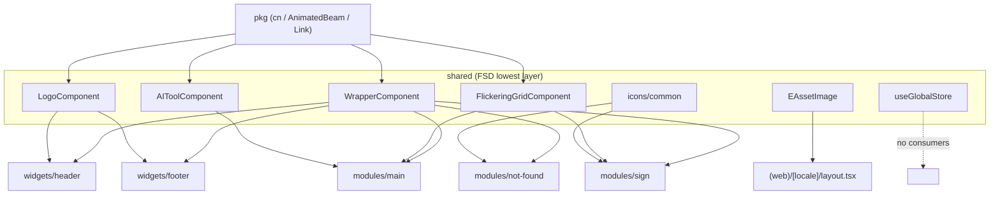

# Client Shared

## Purpose

The **Shared** segment is the lowest Feature-Sliced Design (FSD) layer of the Next.js client (`apps/client/src/app/shared`). It holds cross-cutting, feature-agnostic building blocks — reusable presentational components, SVG/image asset registries, the zustand global store, and shared interfaces/constants — that any higher layer ([[client-modules-widgets]], [[client-app]]) may consume. It depends on nothing above it except the framework-level [[client-pkg]] layer.

## Key files

- `apps/client/src/app/shared/store/global.store.ts` — zustand store `useGlobalStore = create<IStore>()(devtools(...))`. State is a single `menu: boolean`, plus a `setGlobalStore(value: Partial<IState>)` partial-merge setter. Devtools is gated to `process.env.NODE_ENV !== 'production' && typeof window !== 'undefined'` (line 19) to avoid SSR/production instrumentation.
- `apps/client/src/app/shared/store/index.ts` — barrel re-exporting `useGlobalStore`.
- `apps/client/src/app/shared/components/wrapper/wrapper.component.tsx` — `WrapperComponent`: renders `<main>` (default `type`, adds `pt-[88px] pb-20`) or `<section>`, both `mx-auto w-full max-w-[1500px] px-4`, merging `className` via `cn()`. The most-reused shared component (modules + widgets). Server-compatible (no `'use client'`).
- `apps/client/src/app/shared/components/logo/logo.component.tsx` — `LogoComponent`: minimal placeholder rendering a locale-aware `<Link href='/'>Logo</Link>` from `@/pkg/locale`. Server-compatible.
- `apps/client/src/app/shared/components/flickering-grid/flickering-grid.component.tsx` — `FlickeringGridComponent`: `'use client'` canvas animation using `requestAnimationFrame`, `ResizeObserver` + `IntersectionObserver` (only animates while in view), DPR-aware; color parsed to `rgba` via an offscreen 1×1 canvas.
- `apps/client/src/app/shared/components/ai-tool/ai-tool.component.tsx` — `AIToolComponent`: `'use client'` decorative graphic wiring `lucide-react` icons with `AnimatedBeam` connectors from `@/pkg/theme/ui/animated-beam`. Empty `IProps {}`. Contains a hardcoded `Logo` text node (does not reuse `LogoComponent`).
- `apps/client/src/app/shared/assets/icons/common/index.ts` — icon barrel: `IconAuthBackgroundShape`, `IconAuthLines` (hand-written TSX SVG components) and `IconNotFound` (`./not-found.svg` imported as a React component via `@svgr`).
- `apps/client/src/app/shared/assets/icons/common/auth-background-shape.tsx` / `auth-lines.tsx` — SVG-as-React components spreading `SVGAttributes`; style via theme CSS vars `var(--primary)` / `var(--primary-foreground)`, so they track design tokens owned by [[client-pkg]].
- `apps/client/src/app/shared/interfaces/asset.interface.ts` — `enum EAssetImage { FAVICON = '/favicon.ico', OG_IMAGE = '/images/og-image.png' }`; re-exported by `shared/interfaces/index.ts`.
- `apps/client/src/app/shared/assets/images/index.ts` — images barrel, **empty (0 bytes)** placeholder.
- `apps/client/src/app/shared/constants/index.ts` — shared constants barrel, comment-only placeholder (`// add shared constants here`).

## Responsibilities / exports

- **UI primitives** — feature-agnostic presentational components: `WrapperComponent` (page/section layout), `LogoComponent`, plus decorative client visuals `FlickeringGridComponent` and `AIToolComponent`.
- **Asset registries** — SVG icons exposed as React components under `assets/icons/common`, plus a (still-empty) `assets/images` barrel.
- **Global UI state** — `useGlobalStore` for cross-cutting state (currently only a `menu` boolean) with a partial-merge setter and dev-gated devtools.
- **Shared types/constants** — `EAssetImage` enum via `shared/interfaces`, and a placeholder `shared/constants` barrel.

Each subfolder follows the FSD per-slice convention: a `<name>.component.tsx` implementation `export default`-ing the component, plus an `index.ts` barrel re-exporting it as a named export (`export { default as WrapperComponent }`). Components carry the `*Component` suffix. See [[conventions-and-skills]] (the `client-structure` skill governs this layout).

## How it is wired

Shared components import cross-cutting helpers from [[client-pkg]], never from each other:

```
WrapperComponent, FlickeringGridComponent  ->  cn         @/pkg/theme/lib/utils
AIToolComponent                            ->  AnimatedBeam  @/pkg/theme/ui/animated-beam
LogoComponent                              ->  Link       @/pkg/locale
```

Imports resolve through the `@/* -> ./src/*` alias (`apps/client/tsconfig.json:25-29`). Consumers reference full slice paths like `@/app/shared/components/wrapper` — there is **no** root `apps/client/src/app/shared/index.ts` barrel.

`not-found.svg` is consumed as a React component (`export { default as IconNotFound } from './not-found.svg'`), enabled by the `@svgr/webpack` loader configured for **both** turbopack and webpack in `apps/client/next.config.ts:33-46`.



## Depends on / talks to

- **[[client-pkg]]** — sole upstream dependency: `cn`, `AnimatedBeam`, `Link`, and the theme CSS tokens the SVGs reference.
- **[[client-modules-widgets]]** — primary consumers: `modules/main` (`AIToolComponent`, `FlickeringGridComponent`, `WrapperComponent`), `modules/not-found` (`IconNotFound`, `WrapperComponent`), `modules/sign` (`IconAuthBackgroundShape`, `IconAuthLines`, `FlickeringGridComponent`, `WrapperComponent`), `widgets/header` and `widgets/footer` (`LogoComponent`, `WrapperComponent`).
- **[[client-app]]** — `(web)/[locale]/layout.tsx` imports `EAssetImage` for metadata (favicon / OG image). See also [[client-routing]].
- **[[client-config]]** — TS path alias and `next.config.ts` svgr setup that make shared imports resolve.
- **[[conventions-and-skills]]** — the FSD slice/segment layout and `*Component` naming are enforced by the `client-structure` skill.

## Uncertainties / notes

- **`useGlobalStore` has no consumers** anywhere in `apps/client/src` (verified: grep finds it only inside `shared/store`). It is scaffolding awaiting first use; the only state field is the `menu` boolean.
- **`AIToolComponent` IS used** — imported and rendered at `apps/client/src/app/modules/main/main.component.tsx:82`. (This corrects a pre-gathered note claiming it was unused.)
- **`LogoComponent` is consumed by both `widgets/header` and `widgets/footer`** (not just the header).
- **Empty / placeholder files:** `shared/assets/images/index.ts` (0 bytes) and `shared/constants/index.ts` (comment-only). The sibling **entities** (`entities/api/index.ts`, `entities/models/index.ts` — both 0 bytes) and **features** (`features/index.ts` — comment-only) FSD layers exist only as placeholders and have no real code in this template. These layers are not part of the `shared` segment but live alongside it under `apps/client/src/app/`.
- This client app's FSD slice/segment layout and `*Component` naming are governed by the `client-structure` skill (see [[conventions-and-skills]] and [[architecture]]).
