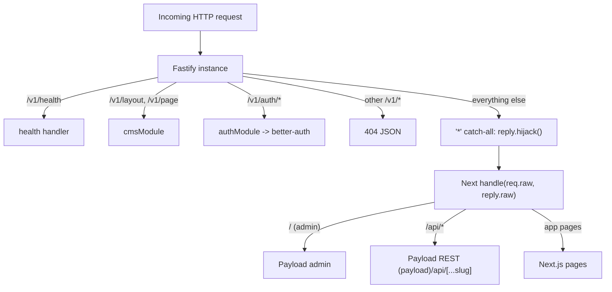
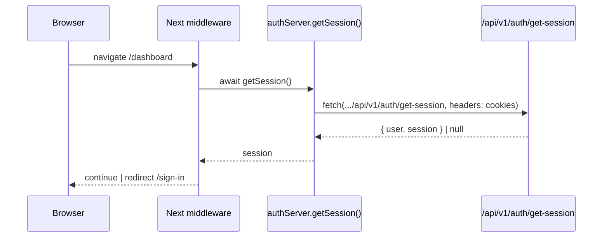

# Data Flow

## What it is

The end-to-end request and data lifecycles of this monorepo: how the **Fastify** server fronts a single **Next.js + Payload** app via a catch-all, how the Next.js client's `rest-api` package (ky + react-query) calls the Fastify `/v1` API, how CMS content flows out of Payload collections through the `cms` module, and how **better-auth** sessions are issued and verified across server and client via cookies.

There are four distinct flows worth tracing:
1. **Request routing** — Fastify owns `/v1/*`, everything else falls through to Next.js.
2. **CMS read** — `/v1/layout` & `/v1/page` → Redis cache → Payload local API → validated reply.
3. **Client data fetch** — ky fetcher + react-query QueryClient.
4. **Auth** — issuance (better-auth on the server), verification (Fastify plugin), propagation (client middleware + cookies).

For the layered/FSD source layout that organizes these flows see [[architecture]]; for the server side see [[server-app]], for the client side see [[client-app]].

## 1. Request routing (Fastify ⇄ Next.js)

One Fastify process serves both the JSON API and the Next.js (Payload) app. The split is by URL prefix.



**Bootstrap order is load-bearing** (`apps/server/src/server.ts:38-55`). Plugins register in a fixed sequence: `fastifyCors` → `cookie` → `compress` → `rateLimit` → `fastify-cacheman`(redisCache) → `gracefulShutdown` → (non-prod only) `fastifySwagger` + `fastifySwaggerUi` → `authPlugin` → Zod `validatorCompiler`/`serializerCompiler` → `serverRoutes(server)`.

**The Next.js catch-all registers LAST and only at runtime**, inside `start()` after `await admin.prepare()` (`apps/server/src/server.ts:57-87`). It is a child plugin that:
- removes all content-type parsers and adds a wildcard `'*'` parser that calls `done(null)` — i.e. it does **not** read the body, leaving the raw stream for Next;
- registers a route for `GET/POST/PUT/DELETE/PATCH/HEAD` on url `'*'` that calls `reply.hijack()` (Fastify stops managing the response), parses `req.raw.url`, and hands `req.raw`/`reply.raw` to Next's `handle()`;
- on error writes a `500` JSON only if `!reply.raw.headersSent`.

**Route precedence** (`apps/server/src/app/routes/server.routes.ts`): the `/v1` prefix tree — `GET /v1/health`, `cmsModule`, `authModule`, and a `server.all('/v1/*')` 404 fallback — is matched by Fastify first. Any non-`/v1` path falls through to the Next.js catch-all. So Payload admin (mounted at `/`, `apps/server/src/payload.config.ts:42-44`), the Payload REST API under `/api/*`, and Next app pages are all owned by Next. See [[payload-cms]] and [[server-modules]].

## 2. CMS read flow

`cmsModule` (`apps/server/src/app/modules/cms/cms.module.ts`) declares two GET routes, each with a Zod querystring schema and a per-status response schema map, delegating to `cmsService`:
- `GET /v1/layout` — querystring `SLayoutQs`, response `SLayoutRes`.
- `GET /v1/page` — querystring `SPageQs`, response `SPageRes`.

`cmsService` (`apps/server/src/app/modules/cms/cms.service.ts`) read path:

```
cacheKey = `layout:${req.url}` | `page:${req.url}`
  -> server.cacheman.get(cacheKey)         # Redis via fastify-cacheman
     hit  -> reply.code(200).send(cached)
     miss -> db = await dbService           # single Payload local API instance
             layout: db.findGlobal({ slug: 'layout', locale })
             page:   db.find({ collection: 'pages',
                               where: { slug: {equals}, _status: {equals: 'published'} },
                               locale, limit: 1 }).docs[0]
             !data?.id -> reply.code(404).send({ error: 'Not Found' })
             server.cacheman.set(cacheKey, data, ECacheTTL.FOUR_HOURLY)  # 14400s = 4h
             reply.code(200).send(data)
  catch -> server.log.error; reply.code(500)
```

Notes verified against source:
- The cache key is the **full `req.url`**, so each locale/slug variant gets a distinct Redis key (`cms.service.ts:14,50`). TTL is `ECacheTTL.FOUR_HOURLY = 14400` seconds (`apps/server/src/pkg/cache/cache.interface.ts:6`).
- `dbService` is a **single in-process Payload instance** — `getPayload({ config })` exported directly and `await`-ed on each call (`apps/server/src/pkg/payload/db/db.service.ts:5`). Content reads use the Payload **local API**, not HTTP. See [[server-pkg]] and [[database-and-migrations]].
- The page query targets the `pages` collection (`PageCollection`) and `layout` global (`LayoutGlobalCollection`), both registered in `apps/server/src/payload.config.ts:48-57`. GraphQL is disabled there (`graphQL.disable: true`). See [[server-collections]].
- **Response validation** is enforced by `server.setSerializerCompiler(serializerCompiler)` against per-status Zod maps `SLayoutRes`/`SPageRes` (keys `200/400/404/500`), and querystrings by `validatorCompiler` against `SLayoutQs`/`SPageQs` (`server.ts:52-53`; DTOs in `apps/server/src/app/entities/dto/layout.dto.ts` and `pages.dto.ts`). `SPageQs` requires a non-empty `slug` and defaults `locale` to `'en'`. See [[server-features-blocks]] for the block DTOs these responses embed.

> Note: `SPageData.meta` is `z.object({})` (empty) (`pages.dto.ts:18`), so any SEO meta on a Payload page is effectively stripped/unvalidated in the `/v1/page` response. The TS `Reply` types `ILayoutRes`/`IPageRes` are `z.infer` over the *status→schema map object* rather than a union of bodies, so the generic typing on `cmsService` is loose even though the serializer validates correctly per status. (Both look intentional-but-rough; worth confirming.)

## 3. Client data fetch (ky + react-query)

Lives in the client `rest-api` package — see [[client-pkg]].

- **Fetcher** (`apps/client/src/pkg/rest-api/fetcher/rest-api.fetcher.ts`): a ky instance with `prefixUrl = NEXT_PUBLIC_CLIENT_API_URL + '/v1'` and **`throwHttpErrors: false`**. Non-2xx responses are returned as `Response` objects, so callers must branch on `response.status` rather than `try/catch`.
- **QueryClient** (`apps/client/src/pkg/rest-api/service/rest-api.service.ts`): `getQueryClient()` returns a fresh `QueryClient` per request when `isServer`, and a module-level browser singleton otherwise — preventing cross-request state bleed during SSR. Defaults: `staleTime 60s`, `networkMode 'offlineFirst'`, `refetchOnWindowFocus false`, `placeholderData keepPreviousData`. `dehydrate.shouldDehydrateQuery` also dehydrates `'pending'` queries (streaming-SSR / prefetch support).
- **Provider** (`apps/client/src/pkg/rest-api/rest-api.provider.tsx`): wraps the tree in `QueryClientProvider` + `ReactQueryDevtools`.

> Note: `restApiFetcher` is exported but I found **no concrete data hook/service** in `apps/client/src` that consumes it (only re-exports). The client→`/v1` CMS call sites appear to be scaffolding, not yet wired. (unverified beyond grep)

## 4. Auth flow

### Issuance (server)
- `authModule` (`apps/server/src/app/modules/auth/auth.module.ts`) mounts a catch-all `/v1/auth/*` route (all methods) with **per-path rate limits**: `sign-in` → 5/min, `sign-up` → 3/min, else 60/min.
- The handler (`apps/server/src/app/modules/auth/auth.service.ts`) rebuilds a Web `Request` from the Fastify request, forwards headers, and calls `auth.handler(req)`, copying status/headers/body back onto the Fastify reply.
- The better-auth instance (`apps/server/src/pkg/auth/auth.service.ts`) is configured with email/password, JWT cookie-cache sessions, `baseURL = SERVER_BASE_URL + '/v1/auth'`, `bearer()` + `openAPI()` plugins, and a Postgres `Pool`. It uses **custom model/field names** (`customers`, `customers_session`, `account`) and sets the session cookie name to `session-token` (secure variant `__Secure-session-token`).

### Verification (server)
- `authPlugin` (`apps/server/src/pkg/auth/auth.plugin.ts`) decorates the request with `authenticate`: it short-circuits `401` if neither `__Secure-session-token` nor `session-token` cookie is present (names from `apps/server/src/pkg/auth/auth.constant.ts`), otherwise calls `auth.api.getSession({ headers })` and attaches `request.session` / `request.user`. Full coverage in [[auth]].

### Propagation (client)

- `apps/client/src/middleware.ts` bypasses `/api/*` with `NextResponse.next()`, runs `next-intl`, injects `x-country` (from `cf-ipcountry` / `cloudfront-viewer-country` / `X-Country` / `country` cookie), then gates `/dashboard` (redirect to `/sign-in` if no session) and `/sign-in` (redirect to `/dashboard` if a session exists). See [[client-routing]].
- `apps/client/src/pkg/auth/server/auth.server.ts`: `getSession()` does a server-side `fetch` forwarding incoming headers (cookies); `getCacheSession()` reads the `better-auth.session_data` (or `__Secure-...`) cookie and `jwtVerify`s it locally with `JWT_SECRET` (jose), avoiding a network round-trip.
- `apps/client/src/pkg/auth/client/auth.client.ts`: better-auth React client pointed at `NEXT_PUBLIC_CLIENT_API_URL + '/v1/auth'` for browser components.

> **Discrepancy (verified):** `authServer.getSession()` fetches `.../api/v1/auth/get-session` (note the `/api` prefix), whereas the browser client and the server better-auth `baseURL` use `.../v1/auth` (no `/api`). The Fastify better-auth routes live at `/v1/auth/*`; the `/api/*` namespace is owned by the Payload/Next app (`apps/server/src/app/(payload)/api/[...slug]/route.ts`). I found **no Next rewrite** in `apps/client/next.config.ts` mapping `/api/v1/auth/*` → `/v1/auth/*`. As written, `getSession()` would hit Payload's REST handler, not better-auth — a likely bug, or it relies on an unseen infra-level rewrite. Surfaced for follow-up.

## Where it lives

- Server routing & hijack: `apps/server/src/server.ts`, `apps/server/src/app/routes/server.routes.ts` → [[server-app]]
- CMS read: `apps/server/src/app/modules/cms/` + DTOs in `app/entities/dto/` → [[server-modules]], [[server-collections]], [[server-features-blocks]]
- Payload local API & cache: `apps/server/src/pkg/payload/db/`, `apps/server/src/pkg/cache/` → [[server-pkg]], [[payload-cms]]
- Auth (server): `apps/server/src/pkg/auth/`, `apps/server/src/app/modules/auth/` → [[auth]]
- Client data layer: `apps/client/src/pkg/rest-api/` → [[client-pkg]]
- Client auth & routing: `apps/client/src/pkg/auth/`, `apps/client/src/middleware.ts` → [[client-routing]], [[client-app]]
- Config/env that parameterize URLs & DB: → [[server-config-shared]], [[client-config]], [[database-and-migrations]]

See also [[architecture]] and [[index]].
