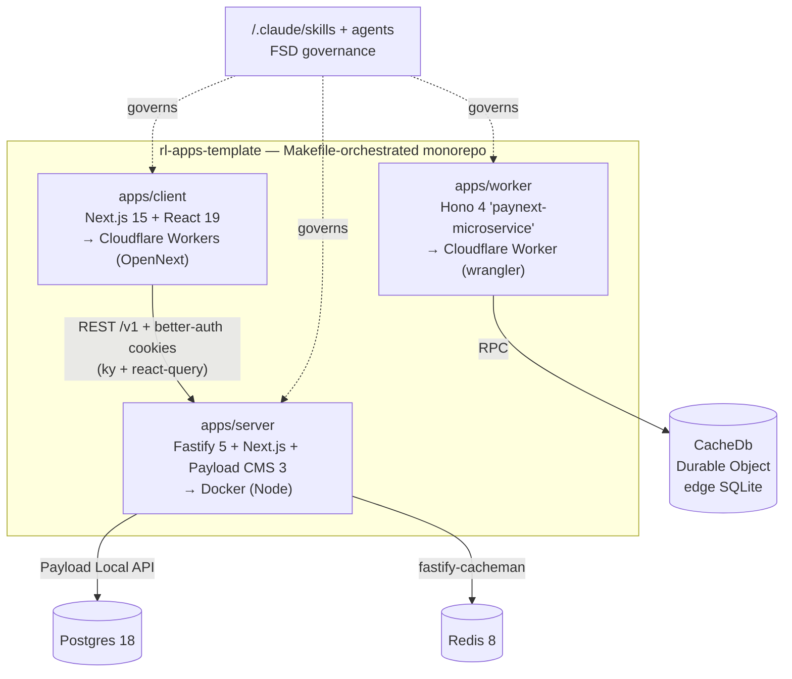

# Codebase Wiki — rl-apps-template

A **starter template monorepo** for shipping a product across three runtimes that
share one source-layout vocabulary. The repo is *co-location only* — there is no
root `package.json` or Yarn workspace; a root `Makefile` orchestrates three
self-contained apps under `apps/`, and `infra/docker-compose.yml` provides local
Postgres + Redis.

| App | Stack | Ships as |
|---|---|---|
| `apps/client` | Next.js 15 · React 19 · next-intl · TanStack Query + ky · zustand · Tailwind v4 / shadcn · better-auth | Cloudflare Workers (OpenNext) |
| `apps/server` | Fastify 5 wrapping Next.js 15 + **Payload CMS 3** · Postgres · Redis · better-auth | Docker (long-lived Node) |
| `apps/worker` | Hono 4 (`paynext-microservice`) · `CacheDb` Durable Object · zod | Cloudflare Worker (wrangler) |

Every app uses the same **Feature-Sliced Design** layout (Layer → Slice → Segment:
`app/{modules,widgets,features,entities,shared}` + hoisted `config/` and `pkg/`),
governed by the structure skills under `.claude/skills/` — see
[[conventions-and-skills]].

## Architecture at a glance

A deeper per-app process model (Fastify-wraps-Next hijack route, the worker's
middleware chain, etc.) is in [[architecture]]; end-to-end request/data lifecycles
are in [[data-flow]].

## Pages

### Concepts (cross-cutting)
- [[architecture]] — Co-located three-app monorepo + the shared FSD layout, per-app process models, and the doc/disk discrepancies to know.
- [[data-flow]] — End-to-end lifecycles: Fastify `/v1` API vs the Next.js catch-all, CMS reads (Redis + Payload Local API), client `ky`+react-query fetch, and better-auth session issuance/verification.
- [[build-and-deploy]] — Per-app dev/build/ship: client (Next→OpenNext/Workers), server (Fastify+Payload→Docker), worker (Hono→wrangler), the `make` entrypoints, and the Compose infra.
- [[auth]] — better-auth across the stack: the server instance proxied via `/v1/auth/*`, the `authenticate` Fastify guard, four Payload Postgres collections, and the Next.js client + middleware gating.
- [[database-and-migrations]] — Payload Postgres adapter (UUID ids, `push:false`), dated up/down SQL migrations, and the `fastify-cacheman` Redis/memory + CDN cache layer.
- [[conventions-and-skills]] — The governance layer: Feature-Sliced Design, naming rules, and the `.claude/skills/` + `agent-skill-architect` that encode them (CLAUDE.md itself now holds only generic engineering guidelines).

### Client (`apps/client`)
- [[client-app]] — Next.js 15 App Router shell: thin root layout + locale layout, the `ThemeProvider > NextIntlClientProvider > RestApiProvider` stack, and the FSD `src/` layout.
- [[client-routing]] — The URL surface: `(web)/[locale]` tree, next-intl localization, `(auth)/(protected)/(public)` route groups, and edge middleware for geo + auth redirects.
- [[client-modules-widgets]] — The Module (layout/main/not-found/sign) and Widget (header/footer) layers that compose shared + pkg primitives into rendered UI.
- [[client-shared]] — The Shared layer: reusable components (Wrapper/Logo/FlickeringGrid/AITool), the SVG icon registry, the zustand global store, and shared interfaces/constants.
- [[client-pkg]] — The integration layer: thin wrappers over better-auth, next-intl, `ky`+TanStack Query, and next-themes/shadcn/sonner.
- [[client-config]] — Typed env (t3-env client/server split), Google fonts as CSS vars, the global Tailwind v4 stylesheet, and the next-intl message catalog.

### Server (`apps/server`)
- [[server-app]] — The Fastify 5 entry: cross-cutting plugins, the `/v1` REST API, and Next.js + Payload embedded via a hijack-based catch-all route.
- [[payload-cms]] — Payload CMS 3 via `buildConfig()`: Postgres, collections, lexical editor, SEO + S3 plugins, the admin panel, and the `cms` module reading content through the Local API.
- [[server-collections]] — The Entity layer: 7 collections + 1 global (auth/bucket/content/system) and the zod DTOs that type the public content API.
- [[server-features-blocks]] — The Feature layer: five reusable Payload Block configs that editors compose into pages and the layout global.
- [[server-modules]] — The Fastify module/route layer: `*.module.ts` registrars delegating to `*.service.ts`, aggregated under `/v1` by `server.routes.ts`.
- [[server-pkg]] — The integration layer: reusable Payload field factories (action/input/seo/slug/version), the Local-API db client, the composed plugin list, and the cache wrapper.
- [[server-config-shared]] — Fastify config objects (cors/cookie/compress/rate-limit/swagger/graceful-shutdown), validated `envConfig`, db-pool tuning, locales, and the Shared segment's Payload access predicates.

### Worker (`apps/worker`)
- [[worker-app]] — The `paynext-microservice` entry: the Hono bootstrap + middleware chain, `wrangler.jsonc` (the `CacheDb` Durable Object, `v1` SQLite migration, single-env config), typed env, and deploy.
- [[worker-modules]] — The one populated slice: the `webhooks` CRUD module (Cache API + invalidation), its service, the `CacheDb` Durable Object (edge SQLite), the zod schemas, and the `validator`/`middleware` pkgs.

---

*This wiki is maintained by the AI agent per the conventions in `AGENTS.md`. Pages
cross-link with `[[wikilinks]]`; every claim is grounded in the actual source.
Start anywhere and follow the links. The append-only run history is in `log.md`.*
