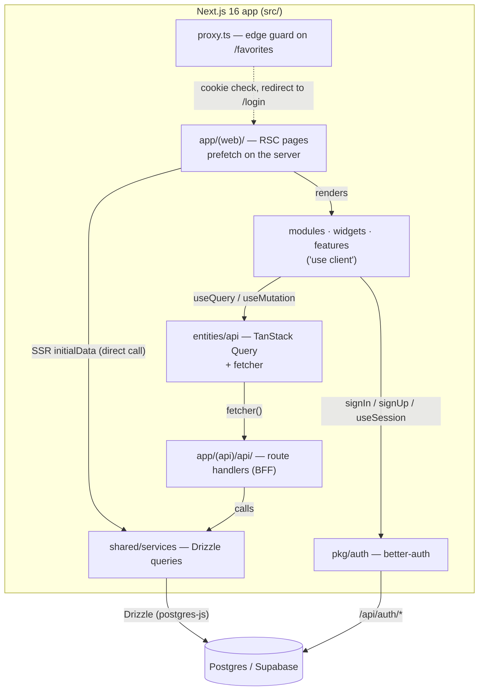

# Codebase Wiki — BookShelf (`homework-catalog`)

A small **single-app Next.js 16 book catalog**. Anonymous visitors browse and
search a paginated catalog of books; authenticated users favorite books and see
a personal favorites list. One Next.js App-Router project holds everything —
server-rendered pages, a thin `/api` BFF, auth, and the database layer — laid out
with **Feature-Sliced Design** under `src/`.

There is no monorepo, no CMS, and no separate backend service: the Next.js app is
both the frontend and the API.

| Concern | Choice |
|---|---|
| Framework | Next.js 16 (App Router, RSC) · React 19 |
| Data (client) | TanStack Query v5 + a thin `fetch` wrapper ([[data-layer]]) |
| Forms | react-hook-form |
| Auth | better-auth (email/password + optional GitHub OAuth) ([[auth]]) |
| Database | Postgres (Supabase) via Drizzle ORM ([[database-and-migrations]]) |
| Styling | plain global CSS (no Tailwind) — `src/config/styles/global.css` |
| Layout | Feature-Sliced Design ([[architecture]], [[conventions-and-skills]]) |

## Architecture at a glance

Two data paths worth internalizing (details in [[data-flow]]): the **first catalog
page is server-rendered** by calling `shared/services` directly and handed to the
client as `initialData`; **everything interactive** (search, pagination,
favorites) goes client → `entities/api` → `fetcher` → `/api` route handlers →
`shared/services` → Drizzle.

## Pages

### Concepts (cross-cutting)
- [[architecture]] — The single-app FSD layout, the layer dependency rule, and the two request paths (RSC-direct vs client→BFF).
- [[data-flow]] — End-to-end lifecycles: catalog SSR + client search/pagination, favorites optimistic mutations, item detail.
- [[auth]] — better-auth: the server instance, the `'use client'` auth client, `getSession`, the `/api/auth/*` catch-all, and the `proxy.ts` edge guard.
- [[database-and-migrations]] — Drizzle + Postgres/Supabase: schema, the pgbouncer `prepare:false` client, migrations, and the seed script.
- [[conventions-and-skills]] — FSD governance skills, naming rules, tooling (ESLint/Prettier), and the dev/build/db scripts.

### Layers (`src/`)
- [[routing]] — The URL surface: `(web)` pages (RSC) and the `(api)` route handlers that form the BFF.
- [[data-layer]] — `entities/api` (TanStack Query options + mutations), `entities/models`, the `EEntityKey` query-key enum, and the `pkg/fetcher` / `pkg/tanstack` integrations.
- [[ui-layer]] — `modules` (page domains), `widgets`, `features`, `shared/components`, and `config` (fonts/styles).

---

*This wiki is maintained by the AI agent per `AGENTS.md`. Pages cross-link with
`[[wikilinks]]`; every claim is grounded in the actual source under `src/`. The
append-only run history is in `log.md`.*
