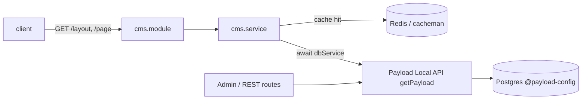

# Payload CMS

**Purpose** — Payload CMS 3.x is embedded inside the server app (a Next.js + Payload + Fastify hybrid). [`payload.config.ts`](../../apps/server/src/payload.config.ts) is the single source of truth that wires the Postgres adapter, collections, the `layout` global, the lexical editor, plugins (SEO + S3), localization and the admin panel. Payload auto-mounts its REST + GraphQL HTTP routes (via Next.js route handlers), generates `payload-types.ts`, and the Fastify `cms` module reads content through Payload's **Local API**.

> Note: `apps/server` runs on Node (Next.js + Fastify + Payload), not as a Cloudflare Worker. The Worker is a separate app — see [[worker-app]].

## Key files

- [`apps/server/src/payload.config.ts`](../../apps/server/src/payload.config.ts) — central `buildConfig()`: admin, DB adapter, collections, globals, lexical editor, plugins, secret, localization, typescript output, `defaultDepth`, `debug`, `graphQL.disable`. Resolved through the `@payload-config` tsconfig path alias.
- [`apps/server/src/pkg/payload/db/db.service.ts`](../../apps/server/src/pkg/payload/db/db.service.ts) — `export const dbService = getPayload({ config })`; the initialized Local API instance (a **promise** — consumers `await` it).
- [`apps/server/src/pkg/payload/plugins/plugin.service.ts`](../../apps/server/src/pkg/payload/plugins/plugin.service.ts) — `plugins` array consumed by the config: `seoPlugin` + `s3Storage` (images collection, prefix `images`). Contains a commented-out `@payload-enchants/translator` block.
- [`apps/server/src/payload-types.ts`](../../apps/server/src/payload-types.ts) — generated TypeScript types for `Config`, every collection, and the `Layout` global. Output target set by `typescript.outputFile`; regenerated via `generate:types`. **Do not hand-edit.**
- [`apps/server/src/app/(payload)/api/[...slug]/route.ts`](../../apps/server/src/app/(payload)/api/[...slug]/route.ts) — auto-generated Next.js handler mounting Payload's REST API (`REST_GET/POST/DELETE/PATCH/PUT/OPTIONS`).
- [`apps/server/src/app/(payload)/api/graphql/route.ts`](../../apps/server/src/app/(payload)/api/graphql/route.ts) + [`graphql-playground/route.ts`](../../apps/server/src/app/(payload)/api/graphql-playground/route.ts) — auto-generated GraphQL POST + Playground GET handlers (present even though GraphQL is disabled in config — see Discrepancies).
- [`apps/server/src/app/(payload)/`](../../apps/server/src/app/(payload)/) — admin panel surface: `layout.tsx`, `admin/`, `[[...segments]]/`, generated `importMap.js`, `custom.scss`, `robots.ts`, and `migrations/` (the dated migration files live here).
- [`apps/server/src/app/modules/cms/cms.service.ts`](../../apps/server/src/app/modules/cms/cms.service.ts) — Fastify service: `await dbService`, then `db.findGlobal({ slug: 'layout' })` and `db.find({ collection: 'pages', ... })`, cached via `fastify-cacheman` (Redis or in-memory).
- [`apps/server/src/app/modules/cms/cms.module.ts`](../../apps/server/src/app/modules/cms/cms.module.ts) — Fastify route registration for `GET /layout` and `GET /page`.
- Config inputs: [`config/env.config.ts`](../../apps/server/src/config/env.config.ts) (`PAYLOAD_SECRET`, `DATABASE_URI`, `DATABASE_URI_READ_ONLY`, `S3_*`), [`config/locale.config.ts`](../../apps/server/src/config/locale.config.ts) (`locales`), [`config/db.config.ts`](../../apps/server/src/config/db.config.ts) (`dbConfig` pool tuning). See [[server-config-shared]].

## Responsibilities / exports

- **Build the whole CMS config** in `payload.config.ts` (`export default buildConfig({...})`):
  - **Admin**: `user: UsersCollection.slug`, generated `importMap` at `app/(payload)/importMap.js`, `createFirstUser` route renamed to `/create-root-user`, meta title `CMS Panel`; the admin panel is mounted at root via `routes.admin: '/'`.
  - **DB** (`@payloadcms/db-postgres`): `idType: 'uuid'`, `migrationDir` at `app/(payload)/migrations`, pool from `envConfig.DATABASE_URI` spread with `dbConfig`, `readReplicas` only when `DATABASE_URI_READ_ONLY` is set, `ssl: { rejectUnauthorized: false }` only in production (AWS RDS), `push: false`. See [[database-and-migrations]].
  - **Collections**: `PageCollection`, `ImagesCollection`, `CustomersCollection`, `UsersCollection`, `VerificationCollection`, `AccountsCollection`, `CustomersSessionCollection` + the `LayoutGlobalCollection` global — all from `app/entities/collections`. See [[server-collections]].
  - **Editor** (`lexicalEditor`): `defaultFeatures` + `TextLetterSpacingFeature()` + `TextLineHeightFeature()` (`payload-lexical-typography`) + `FixedToolbarFeature({ applyToFocusedEditor: false })`.
  - **Misc**: `secret: envConfig.PAYLOAD_SECRET`, `localization: locales`, `sharp`, `defaultDepth: 1`, `debug: NODE_ENV !== 'production'`, `graphQL: { disable: true }`, `typescript.outputFile` → `payload-types.ts`.
- **Auto-mount HTTP surfaces** via `@payloadcms/next/routes`: REST under `/api/[...slug]`, plus the GraphQL POST + Playground endpoints, all importing the config through `@payload-config`.
- **Expose the Local API** (`dbService = getPayload({ config })`) so server-side Fastify code queries content directly without HTTP.
- **Serve CMS content** through the Fastify `cms` module: `GET /layout` and `GET /page`, both locale-aware and cached via `fastify-cacheman` at `ECacheTTL.FOUR_HOURLY` (Redis when `REDIS_URL` is set, in-memory otherwise). See [[server-modules]].

## How content reaches the client

- `cms.service.ts` checks the cache (`server.cacheman`, Redis when `REDIS_URL` is set, in-memory otherwise) first; on miss it `await dbService` then queries.
- Pages are queried with `where: { slug: { equals: slug }, _status: { equals: 'published' } }, limit: 1` — confirming `PageCollection` uses Payload **drafts/versions** (`_status`).
- `dbService` is a promise; every consumer does `const db = await dbService` before calling Local API methods.

## Config & tooling facts

- `@payload-config` is a tsconfig path alias → `./src/payload.config.ts` (`apps/server/tsconfig.json:25`). The generated route files and `db.service.ts` all import from it.
- Generated `Config` (`payload-types.ts`) enumerates registered slugs: `pages`, `images`, `customers`, `users`, `verification`, `account`, `customers_session` plus Payload internals (`payload-kv`, `payload-locked-documents`, `payload-preferences`, `payload-migrations`), the single global `layout`, and `locale: 'en' | 'de' | 'ar'`.
- `locales` (`locale.config.ts`): `en`/`de`/`ar` (Arabic `rtl: true`), `defaultLocale: 'en'`, `fallback: true`.
- S3 storage is scoped to **only** the `images` collection (prefix `images`, `forcePathStyle: true`), driven by `S3_*` env vars.
- Pinned to Payload **3.66.0** across `@payloadcms/*` (`db-postgres`, `next`, `plugin-seo`, `richtext-lexical`, `storage-s3`, `ui`, `payload`) plus `payload-lexical-typography ^0.5.2` (`package.json:32-49`).
- Payload scripts (`apps/server/package.json`): `payload`, `generate:importmap`, `generate:types`, `generate:schema` (→ `payload generate:db-schema`), `migrate:dev` (→ `payload migrate:create`), `migrate:dep` (→ `payload migrate`). The `dev` script chains `generate:types → generate:importmap → migrate:dep → nodemon`; `build` runs `migrate:dep → next build → tsup`. See [[build-and-deploy]].

## Depends on / talks to

- [[server-collections]] — every collection/global registered in the config lives there; the auth-related ones (`users`, `customers`, `accounts`, `verification`, `customers_session`) back [[auth]].
- [[server-config-shared]] — `envConfig`, `locales`, `dbConfig` feed `buildConfig()`.
- [[database-and-migrations]] — Postgres adapter, `migrationDir`, `push: false`, read replicas, uuid ids.
- [[server-app]] / [[server-modules]] — the Fastify `cms` module exposes layout/page endpoints; the Next.js `(payload)` segment hosts the admin panel + auto-routes.
- [[server-pkg]] — `pkg/payload/db` (Local API) and `pkg/payload/plugins` are the package-layer wiring; `pkg/cache` supplies `ECacheTTL`.
- [[auth]] — admin panel auth is keyed on the `users` collection slug.
- [[build-and-deploy]] — generate/migrate scripts run during dev and build.
- [[client-app]] — consumes `/layout` and `/page` to render CMS-driven content.

## Discrepancies / uncertainties

- **GraphQL disabled but routes committed**: `graphQL: { disable: true }` (`payload.config.ts:45-47`), yet `api/graphql/route.ts` and `api/graphql-playground/route.ts` still exist (auto-generated). These endpoints would not serve a schema while disabled — likely leftover scaffold output.
- **Dead translator block**: `plugin.service.ts` has a commented-out `@payload-enchants/translator` block referencing `envServer.OPENAI_API_KEY` — a name that does not exist in `envConfig` (no `OPENAI_API_KEY` defined). Aspirational/dead code, not active.
- **NODE_ENV mismatch**: `env.config.ts` enum is `['local','production','development']`, while `payload.config.ts` only branches on `NODE_ENV === 'production'` (for ssl + debug). The `'development'` value never matches the wrangler `develop` naming elsewhere in the repo — consistent with this app running on Node, not as a Worker.
- The `app/(payload)/importMap.js` contents and individual migration files were confirmed to exist via directory listing but not read line-by-line here. (partially unverified)
