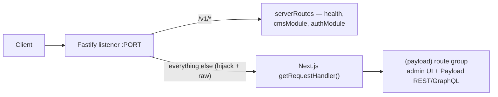

# Server App

**Purpose** — The entry point and HTTP composition layer of the server. A Fastify 5 custom server owns the socket: it registers cross-cutting plugins, wires the app's REST API under `/v1`, then embeds a Next.js 15 instance (wrapped by Payload's `withPayload`) so that all non-`/v1` traffic — the Payload CMS admin UI and Payload's own REST/GraphQL — falls through to Next via a catch-all route.

## Key files

- `apps/server/src/server.ts` — Process entry point. Builds the Fastify instance with the Zod type provider, registers all plugins, sets the Zod validator/serializer compilers, mounts `serverRoutes(server)`, then in `start()` awaits `admin.prepare()`, registers an encapsulated catch-all plugin that delegates to the Next handler, and `listen`s on `0.0.0.0:PORT`.
- `apps/server/src/app/routes/server.routes.ts` — `serverRoutes(server)`: registers `GET /v1/health`, the `cmsModule` (public) and `authModule` (private) both under the `/v1` prefix, and a `server.all('/v1/*')` 404 fallback. See [[server-modules]].
- `apps/server/src/app/routes/index.ts` — Barrel re-exporting `./server.routes`.
- `apps/server/src/config/server.config.ts` — `serverConfig` (timeouts, 10 MB `bodyLimit`, pino-pretty logger) plus the `compress`/`cors`/`cookie`/`rateLimit`/`gracefulShutdown` option objects consumed by `server.ts`. See [[server-config-shared]].
- `apps/server/next.config.ts` — Next.js config wrapped by `withPayload(nextConfig, { devBundleServerPackages: false })`; disables `poweredByHeader`, tunes experimental static-generation concurrency.
- `apps/server/src/app/(payload)/layout.tsx` — Root layout for the Payload admin route group. Renders Payload's `RootLayout` with the imported config + `importMap`, defines the `'use server'` `serverFunction` handler, and imports `@payloadcms/next/css` + `./custom.scss`.
- `apps/server/src/app/(payload)/[[...segments]]/page.tsx` — Auto-generated optional-catch-all mounting Payload's `RootPage` / `generatePageMetadata` for the whole admin panel. **Do not edit** (Payload-generated).
- `apps/server/src/app/(payload)/[[...segments]]/not-found.tsx` — Auto-generated 404 view delegating to Payload's `NotFoundPage`. **Do not edit** (Payload-generated).
- `apps/server/src/app/(payload)/importMap.js` — Payload-generated map of custom React components passed into admin views (Lexical features incl. `payload-lexical-typography`, plugin-seo fields, the S3 upload handler, and the custom `@/pkg/payload/fields/slug/slug.component#SlugComponent`). Regenerated with `yarn generate:importmap`.
- `apps/server/src/app/(payload)/custom.scss` — Admin-UI style overrides.
- `apps/server/src/app/(payload)/robots.ts` — Next metadata route; currently `disallow: '*'` for all agents (admin is locked out of indexing by default).
- `apps/server/package.json` — Scripts and deps for the server app.

## Responsibilities

1. **Bootstrap one Fastify 5 instance** with the Zod type provider: `fastify(serverConfig).withTypeProvider<ZodTypeProvider>()`, plus `setValidatorCompiler` / `setSerializerCompiler` from `fastify-type-provider-zod`.
2. **Register cross-cutting plugins** in order: `@fastify/cors`, `@fastify/cookie`, `@fastify/compress`, `@fastify/rate-limit`, `fastify-cacheman` (with `redisCache` from [[server-pkg]]), `fastify-graceful-shutdown`, then the local `authPlugin`. See [[auth]].
3. **Gate Swagger** — `@fastify/swagger` + `@fastify/swagger-ui` (with `jsonSchemaTransform`) are registered only when `NODE_ENV !== 'production'` (`server.ts` lines 45-48).
4. **Mount the REST API** via `serverRoutes(server)` under `/v1` — health, `cmsModule`, `authModule`, and the `/v1/*` 404 fallback.
5. **Embed Next.js / Payload** — create `next({ dev })` (dev from `NODE_ENV`), await `admin.prepare()`, then register an encapsulated catch-all that owns all non-`/v1` traffic. See [[payload-cms]].
6. **Listen** on `envConfig.PORT`, host `0.0.0.0`; `process.exit(1)` on listen failure or any error in `start()`.

## The Next.js handoff

Fastify owns the listener; Next.js is embedded, not the reverse. The catch-all lives inside an **encapsulated** `server.register(async (instance) => …)` so its content-type-parser changes do not leak to the `/v1` API routes (`server.ts` lines 60-87):

```ts
await server.register(async (instance) => {
  instance.removeAllContentTypeParsers()
  instance.addContentTypeParser('*', (_req, _payload, done) => done(null))
  instance.route({
    method: ['GET', 'POST', 'PUT', 'DELETE', 'PATCH', 'HEAD'],
    url: '*',
    schema: { hide: true },
    handler: async (req, reply) => {
      reply.hijack()                       // Fastify stops managing the response
      const parsedUrl = parse(req.raw.url!, true)
      await handle(req.raw, reply.raw, parsedUrl)  // raw streams -> Next handler
    },
  })
})
```



All app API is namespaced under `/v1` (`server.routes.ts`); everything else (admin UI, Payload REST/GraphQL) is served by Next. The Payload admin panel is mounted through the Next App Router `(payload)` route group: `layout.tsx` + `[[...segments]]/page.tsx` / `not-found.tsx` + `importMap.js`. Config and `importMap` reach those files via the path aliases `@payload-config -> ./src/payload.config.ts` and `@/* -> ./src/*` defined in `apps/server/tsconfig.json`.

## Notable config details

- **Config is centralized** — `server.ts` pulls every plugin option from `./config` and reads env only through `envConfig`, per the `/server-structure` env convention. See [[server-config-shared]].
- **rateLimit** keys by the `session-id` cookie (falling back to `x-real-ip` / `x-forwarded-for`, then `127.0.0.1`) and, on breach, logs a structured `event: 'security_violation'` / `type: 'rate_limit_exceeded'` record before returning a 429 (`server.config.ts` lines 53-103). `max` is currently `100000` per minute.
- **cors** allows credentials and a fixed header allowlist (incl. `X-Fctl-Secret`, `X-Header-Secret`); origins come from `envConfig.CORS_ORIGIN` (comma-split). **cookie** is signed with `JWT_SECRET` and defaults to `httpOnly`/`secure`/`sameSite: 'lax'`.
- **Build is dual** — `next build` compiles the Payload/admin Next app and `tsup` bundles `server.ts` to `dist/server.js`; production is `node dist/server.js`. `dev` chains `generate:types && generate:importmap && migrate:dep && nodemon` and `build` runs `migrate:dep && next build && tsup`, so both apply `migrate:dep` (`payload migrate`) before starting/bundling. See [[build-and-deploy]] and [[database-and-migrations]].

## Depends on / talks to

- [[server-config-shared]] — `serverConfig` + all plugin option objects, and `envConfig`.
- [[server-modules]] — `cmsModule` / `authModule` mounted under `/v1`.
- [[auth]] — `authPlugin` registration and the `authModule` private routes.
- [[payload-cms]] — the embedded Next/Payload app, `payload.config.ts`, and the `(payload)` route group.
- [[server-collections]] · [[server-features-blocks]] — content surfaced through the admin (slug field, Lexical/blocks, SEO) wired via `importMap.js`.
- [[server-pkg]] — `redisCache` (cacheman) and the custom `SlugComponent`.
- [[database-and-migrations]] — `migrate:dep` runs before `dev`/`build`.
- [[build-and-deploy]] — the `next build` + `tsup` pipeline and `start` command.
- [[architecture]] · [[data-flow]] — overall layering and the `/v1` vs. Next request split.

## Uncertainties / discrepancies

- `page.tsx`, `not-found.tsx`, and `importMap.js` carry Payload "GENERATED AUTOMATICALLY … DO NOT MODIFY" semantics — regenerate via `yarn generate:importmap` / Payload tooling rather than hand-editing.
- This `apps/server` is a **Fastify 5 + Next.js + Payload** app with no Hono/wrangler usage; its structural source of truth is the `/server-structure` skill (see [[conventions-and-skills]]). The Cloudflare Workers + Hono shape belongs to the separate [[worker-app]] under `/worker-structure`.
- `robots.ts` `disallow: '*'` blocks all crawling; unclear whether that is intended for every environment or only the admin host. The `allow: '/'` line is commented out. (unverified intent)
- `server.routes.ts` has a commented-out `server.addHook('onRequest', secretHook)` — dead/optional code whose intended activation is unconfirmed. (unverified)
