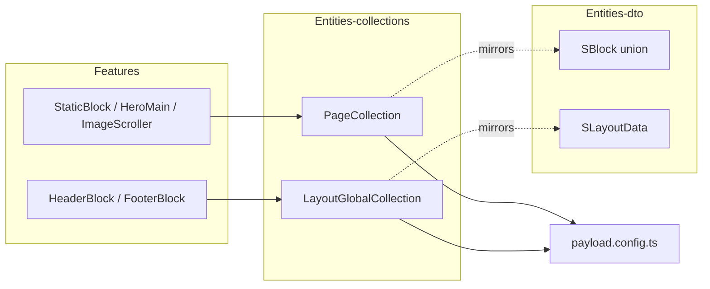

# Server Collections (Entity Layer)

**Purpose:** The Entity layer of the [[payload-cms]]-backed server. It declares every Payload **collection** and **global** that forms the CMS schema (auth, bucket, content, system domains), plus the **zod DTOs** that validate the data shapes — especially blocks — exchanged with the public content API. These objects define the schema, admin-UI grouping, access rules, and content composition.

Lives under `apps/server/src/app/entities/`, split into two sibling sub-barrels with **no** top-level `entities/index.ts`:

```
entities/
├── collections/   # Payload CollectionConfig / GlobalConfig objects (the schema)
│   ├── auth/       account, customers, customers_session, verification
│   ├── bucket/     images
│   ├── content/    pages (collection) + layout (global)
│   ├── system/     users (admin)
│   └── index.ts    barrel → consumed by payload.config.ts
└── dto/           # zod schemas mirroring blocks + typing API responses
    ├── blocks.dto.ts   (NOT re-exported by the barrel — see Gotchas)
    ├── common.dto.ts · layout.dto.ts · pages.dto.ts
    └── index.ts
```

## Key files

### Collections (the CMS schema)
- `apps/server/src/app/entities/collections/index.ts` — barrel re-exporting all 8 configs. Export order: `Verification, Accounts, Customers, CustomersSession, Images, Page, LayoutGlobal, Users`.
- `collections/auth/account.collection.ts` — `AccountsCollection` (slug `account`): OAuth/credential account fields — `userId, accountId, providerId, accessToken, refreshToken, accessTokenExpiresAt, refreshTokenExpiresAt, scope, idToken, password`. Admin group `Profile`, `hidden: true`.
- `collections/auth/customer.collection.ts` — `CustomersCollection` (slug `customers`): end-user record — `name` (required), `email` (required, unique), `image`, `emailVerified` checkbox. Group `Profile` (visible).
- `collections/auth/customer-session.collection.ts` — `CustomersSessionCollection` (slug `customers_session`): `userId, token, expiresAt, ipAddress, userAgent`. Group `Profile`, hidden.
- `collections/auth/verification.collection.ts` — `VerificationCollection` (slug `verification`): `identifier, value, expiresAt, ipAddress, userAgent`. Group `Profile`, hidden.
- `collections/bucket/image.collection.ts` — `ImagesCollection` (slug `images`): upload collection (`mimeTypes: ['image/*']`, converts to `webp` quality 75); single `alt` text field (required, default `'image'`). Group `Bucket`.
- `collections/content/page.collection.ts` — `PageCollection` (slug `pages`): `slug` + `name`, Content tab with `blocks` `[StaticBlock, HeroMainBlock, ImageScrollerBlock]` (`minRows: 1`, `maxRows: 10`), SEO `meta` tab, computed `seoInfo` sidebar field, livePreview, draft versions. Group `Content`.
- `collections/content/layout-global.collection.ts` — `LayoutGlobalCollection` (`GlobalConfig`, slug `layout`): `blocks` `[HeaderBlock, FooterBlock]` (`maxRows: 2`), Branding tab (logo image/SVG toggle, favicon upload → `images`, `socialMediaLinks` array of platform select + url + icon SVG), SEO `meta`, versions. Group `Content`.
- `collections/system/user.collection.ts` — `UsersCollection` (slug `users`, label **Admin**): `name` + `role` select (`root`/`admin`/`content_manager`, default `admin`) and Payload `auth` (`tokenExpiration: 7200`, `maxLoginAttempts: 5`, `lockTime: 600s`). Group `System`, hidden unless current user role ∈ `{root, admin}`. This is the admin-panel user (`payload.config.ts`'s `admin.user`).

### DTOs (validation + API typing)
- `dto/blocks.dto.ts` — `SAction`/`IAction` & `SMedia`/`IMedia` primitives, five block schemas `SFooterBlock, SHeaderBlock, SHeroMainBlock, SImageScrollerBlock, SStaticBlock`, and `SBlock` = `z.discriminatedUnion('blockType', [...])`.
- `dto/layout.dto.ts` — `SLayoutQs` (locale default `'en'`), `SLayoutData` (`branding` + typed `meta` + `blocks: union(SHeaderBlock, SFooterBlock)`), `SLayoutRes` response envelope (200/400/404/500).
- `dto/pages.dto.ts` — `SPageQs` (`slug` non-empty required, `locale` default `'en'`), `SPageData` (`slug`, `meta: z.object({})`, `blocks: SBlock[]`), `SPageRes` envelope.
- `dto/common.dto.ts` — shared HTTP error response schemas: `SBadRequestRes, SUnauthorizedRes, SNotFoundRes, SUnprocessableEntityRes, SInternalErrorRes`.
- `dto/index.ts` — DTO barrel: re-exports `common`, `layout`, `pages` — **but not `blocks`**.

## Responsibilities / exports

- **Declare the schema:** 7 collections + 1 global, registered in `payload.config.ts` (`collections: [PageCollection, ImagesCollection, CustomersCollection, UsersCollection, VerificationCollection, AccountsCollection, CustomersSessionCollection]`, `globals: [LayoutGlobalCollection]`). DB is `postgresAdapter` with `idType: 'uuid'` — see [[database-and-migrations]].
- **Compose content from blocks:** `pages` and `layout` pull block defs from the Features layer (see [[server-features-blocks]]). The features-side block slugs match the DTO `blockType` literals exactly.
- **Validate the public API:** the zod DTOs are the validation mirror of the Payload block defs; they type the responses served by the content modules (see [[server-modules]]).
- **Apply access & admin grouping** per collection (below).

### Access control (from `@/app/shared/service` → [[server-config-shared]])
`access.service.ts` exposes three helpers:

```ts
authenticatedAccess = ({ req }) => Boolean(req.user)
publicAccess        = () => true
rolesAccess({ req }, roles) // true if req.user.role ∈ roles
```

| Collection | create | read | update | delete |
|---|---|---|---|---|
| `images` | authenticated | **public** | authenticated | authenticated |
| `pages` | authenticated | authenticated | authenticated | authenticated |
| `layout` (global) | — | authenticated | authenticated | — |
| `users` | `['root']` | `['root']` | `['root','admin']` | `['root']` |

`images.read` is the only public surface. `page.collection.ts`'s computed `seoInfo` sidebar field additionally gates its own read to `Boolean(req.user)`.

### Shared field helpers (from `@/pkg/payload/fields` → [[server-pkg]])
- `slugField()` — **pages only**; returns `[slug text (unique, indexed) + hidden slugLock checkbox]`, with a `SlugComponent` and `formatSlugHook`.
- `seoFields` — `OverviewField` + `MetaTitleField` (hasGenerateFn) + `MetaDescriptionField` + `MetaImageField` (`relationTo: 'images'`); used by both `pages.meta` and `layout.meta`.
- `versionField` — `{ drafts: { autosave: { interval: 30000 } }, maxPerDoc: 11 }`; used by both content surfaces.

### Notable schema details
- Both content surfaces expose Payload `livePreview` pointed at ``${envConfig.CLIENT_WEB_URL}/${locale.code}`` (consumed by [[client-app]] / [[client-routing]]).
- `pages` has a computed read-only `seoInfo` sidebar field whose `beforeChange` hook counts completed SEO fields → `"SEO: n/3 fields completed"`.
- The `role` select (`users`) and `socialPlatform` select (`layout`) carry `dbName` + `custom.postgres.type: 'text'` to control the generated Postgres column type — see [[database-and-migrations]].

### Block ↔ DTO mapping
The discriminator value (`blockType`) in each zod schema equals the Payload block `slug` from the Features layer:

| DTO schema | `blockType` literal | Used by |
|---|---|---|
| `SStaticBlock` | `staticBlock` | pages |
| `SHeroMainBlock` | `heroMainBlock` | pages |
| `SImageScrollerBlock` | `imageScrollerBlock` | pages |
| `SHeaderBlock` | `headerBlock` | layout |
| `SFooterBlock` | `footerBlock` | layout |



## Depends on / talks to
- [[payload-cms]] — these objects ARE the Payload config; registered in `payload.config.ts`.
- [[server-features-blocks]] — supplies the `blocks` arrays consumed by `pages` and `layout`.
- [[server-pkg]] — `slugField` / `seoFields` / `versionField` helpers and plugins.
- [[server-config-shared]] — `access.service.ts` helpers and `envConfig`.
- [[server-modules]] — content modules read these collections and return DTO-validated responses.
- [[server-app]] — overall server composition.
- [[database-and-migrations]] — Postgres (`uuid`) adapter, `dbName`/`custom.postgres.type` column control.
- [[auth]] — the `account`/`customers`/`customers_session`/`verification` collections back the auth tables.
- [[client-app]] / [[client-routing]] — consume the content API responses and the livePreview URL.

## Gotchas / unverified
- **`blocks.dto` is not re-exported** by `dto/index.ts` (only `common`, `layout`, `pages`). Consumers must import `SBlock`/`SAction`/`SMedia` via the deep path `./blocks.dto` — exactly as `layout.dto.ts` and `pages.dto.ts` do internally. (Verified.)
- **No `entities/index.ts`** — only `collections/` and `dto/` directories exist; the two barrels are independent. (Verified — `ls` shows only those two subdirs.)
- **Admin email verification disabled:** `UsersCollection.auth` has `// verify: true` commented out. (Verified.)
- **`content_manager` role is defined but unused for access:** `rolesAccess`'s role type and the `users.role` select both offer it, but no collection grants it any access. (Verified — no collection passes `'content_manager'` to `rolesAccess`.)
- **Registration order differs from barrel order:** `collections/index.ts` and `payload.config.ts` list the configs in different orders; this is cosmetic (object refs, no inheritance). (Verified.)
- **`SPageData.meta` is `z.object({})`** (unvalidated contents) whereas `SLayoutData.meta` is fully typed (`title`/`description`/`image`) — pages do not validate meta contents. (Verified.)
