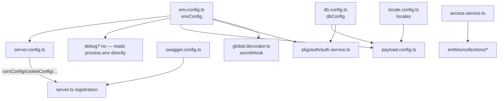

# Server Config & Shared

## Purpose

Centralizes the Fastify server's typed configuration (server/cors/cookie/compress/rate-limit/graceful-shutdown/swagger option objects, validated env, i18n locales, Postgres pool tuning) and the cross-cutting **Shared** segment of the app layer (Payload access-control predicates, a header-secret request hook, a pino debug util, and placeholder barrels). These are the lowest-level building blocks consumed by [[server-app]], [[payload-cms]], [[server-collections]], and [[server-pkg]].

## Key files

Config (`apps/server/src/config/`):

- `env.config.ts` — Type-safe env validation via `@t3-oss/env-core` + `zod`. Exports `envConfig`, the **only** sanctioned way to read process env. Loads `dotenv/config`, `runtimeEnv: process.env`, `emptyStringAsUndefined: true`.
- `server.config.ts` — Fastify plugin option objects: `serverConfig` (60s requestTimeout, 10MB `bodyLimit`, pino-pretty logger), `compressConfig` (br/gzip/deflate), `corsConfig`, `cookieConfig` (httpOnly/secure/sameSite=lax, secret = `JWT_SECRET`), `rateLimitConfig`, `gracefulShutdownConfig` (15s timeout). Reads `envConfig`.
- `db.config.ts` — Plain `pg` pool tuning object `dbConfig` (idle/connection timeouts, keepAlive, `allowExitOnIdle`). No env dependency.
- `locale.config.ts` — `locales` (en / de / ar-with-rtl, `defaultLocale: 'en'`, `fallback: true`).
- `swagger.config.ts` — `swaggerConfig` (OpenAPI info) and `swaggerUiConfig` (`routePrefix: '/v1/docs'`).
- `index.ts` — Barrel re-exporting all five config modules; imported as `@/config` / `./config`.

Shared segment (`apps/server/src/app/shared/`):

- `service/access.service.ts` — Payload access-control helpers: `rolesAccess({req}, roles[])` (role union `root | admin | content_manager`), `authenticatedAccess` (`Boolean(req.user)`), `publicAccess` (`() => true`).
- `service/index.ts` — Barrel re-exporting `access.service`; imported as `@/app/shared/service` by Payload collections.
- `decorator/global.decorator.ts` — `secretHook`, a Fastify `onRequest` hook enforcing `x-header-secret` against `envConfig.HEADER_SECRET` for `/v1` routes (except `/v1/health`), logging security violations and replying `403`.
- `util/debug.util.ts` — `debugUtil({text, value, isActiveOnProd})`, a pino-pretty colorized logger gated by `process.env.NODE_ENV`. No consumers under `src` (currently unused).
- `constant/index.ts`, `interface/index.ts` — empty (0-byte) placeholder barrels.
- `components/index.ts` — placeholder containing only a `// payload cms components` comment; no exports.

## Responsibilities / exports

- **All Fastify plugin option objects** that [[server-app]]'s `server.ts` registers, in order: `corsConfig` → `cookieConfig` → `compressConfig` → `rateLimitConfig` → (cache) → `gracefulShutdownConfig`, then conditionally `swaggerConfig`/`swaggerUiConfig` when `NODE_ENV !== 'production'` (`apps/server/src/server.ts:38-48`).
- **Single validated env surface** via `envConfig`. Required vars: `CORS_ORIGIN`, `SERVER_BASE_URL`, `JWT_SECRET`, `S3_BUCKET`/`S3_ACCESS_KEY_ID`/`S3_SECRET_ACCESS_KEY`/`S3_REGION`/`S3_ENDPOINT`, `DATABASE_URI`, `HEADER_SECRET`, `PAYLOAD_SECRET`. Optional: `REDIS_URL`, `CLIENT_WEB_URL`, `SERVER_SUBDOMAIN`, `DATABASE_URI_READ_ONLY`. Defaults: `PORT` → `4000`, `NODE_ENV` → `'local'` (enum `local | production | development`).
- **Postgres pool tuning** (`dbConfig`) and **i18n locales** reused by both Payload and the auth pkg.
- **Reusable Payload access predicates** (`rolesAccess` / `authenticatedAccess` / `publicAccess`) consumed by [[server-collections]].
- **Cross-cutting request middleware** (`secretHook`) and a **debug logging util** (`debugUtil`).
- **Placeholder barrels** (constant, interface, components) reserved for future shared code.

## How it wires together (in this repo)

- `corsConfig.origin` and the auth pkg's `trustedOrigins` both derive from `envConfig.CORS_ORIGIN.split(',').map(trim)` (`config/server.config.ts:33`; auth uses the same source — see [[auth]]).
- `rateLimitConfig`: `max: 100000` per `'1 minute'`, `global: true`, keyed by cookie `session-id` then `x-real-ip` / `x-forwarded-for`, fallback `127.0.0.1`. Its `errorResponseBuilder` logs a structured `security_violation` / `rate_limit_exceeded` event and returns a 429 (`config/server.config.ts:53-103`).
- `dbConfig` is spread into the Postgres adapter pool options in both `payload.config.ts:77` and `pkg/auth/auth.service.ts` — see [[database-and-migrations]] / [[auth]].
- `locales` feeds `payload.config.ts:85` `localization`.
- Access predicates in use: `rolesAccess` gates `user.collection.ts` (create/read/delete → `['root']`, update → `['root','admin']`); `authenticatedAccess` guards `page` / `layout-global` / `image` mutations; `publicAccess` allows `image` read (`apps/server/src/app/entities/collections/...`).
- `secretHook` is **defined but inactive** — the only reference is a commented line `// server.addHook('onRequest', secretHook)` in `apps/server/src/app/routes/server.routes.ts:12` (the import is also commented/absent).
- Path alias `@/* → ./src/*` (`apps/server/tsconfig.json:24`) enables the `@/config` and `@/app/shared/*` imports.

## Depends on / talks to

- [[server-app]] — `server.ts` registers every plugin config object here; routes layer references `secretHook`.
- [[payload-cms]] — consumes `envConfig`, `dbConfig`, `locales` in `payload.config.ts`.
- [[server-collections]] — collections import the access predicates from `@/app/shared/service`.
- [[server-pkg]] / [[auth]] — the auth pkg reuses `dbConfig` + env vars; the cache pkg reads `envConfig` (`pkg/cache/cache.service.ts`).
- [[database-and-migrations]] — `dbConfig` and `DATABASE_URI` / `DATABASE_URI_READ_ONLY` drive the Postgres pool.
- [[build-and-deploy]] — env vars validated here back the deploy/runtime contract.
- [[architecture]] / [[conventions-and-skills]] — this is the Config layer + Shared segment of the FSD-style server layout (`/server-structure` skill).
- See also [[index]].

## Discrepancies / notes

- The `/server-structure` env convention ("read env only through `envConfig`, never `process.env`") is violated by `util/debug.util.ts:20`, which reads `process.env.NODE_ENV` directly. `env.config.ts:36` reads `process.env` legitimately as the `@t3-oss` `runtimeEnv` source.
- `NODE_ENV` enum is `['local','production','development']` (not `develop`); the production branch is `NODE_ENV === 'production'`. (corrected vs. pre-gathered note)
- `constant/index.ts` and `interface/index.ts` are 0-byte; `components/index.ts` is comment-only — all scaffold placeholders.
- `debugUtil` has no consumers anywhere under `apps/server/src`.
- This server defaults to port `4000`: `envConfig.PORT` defaults to `4000` and `server.listen({ port: envConfig.PORT })` (`server.ts:89`). (Port 5000 is the separate Worker app's `wrangler dev` port — see [[worker-app]] / [[build-and-deploy]] — not this server's.)
