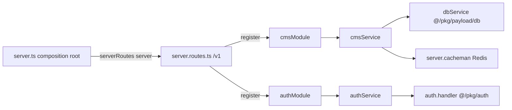

# Server Modules

## Purpose

The module + route layer of the Fastify server. Each **module** is a small `*.module.ts` that registers Fastify routes and thin-delegates handler logic to a sibling `*.service.ts`. The aggregator [`routes/server.routes.ts`](../../apps/server/src/app/routes/server.routes.ts) collects every module, mounts it under the `/v1` prefix, and is invoked once from the composition root in [[server-app]].

## Key files

- `apps/server/src/app/routes/server.routes.ts` — route aggregator. Defines `routePrefixV1 = '/v1'`, a hidden `GET /v1/health`, registers `cmsModule` and `authModule` (both with `{ prefix: '/v1' }`), and a catch-all `server.all('/v1/*')` returning a structured 404.
- `apps/server/src/app/routes/index.ts` — barrel: `export * from './server.routes'`.
- `apps/server/src/app/modules/auth/auth.module.ts` — registers a catch-all `/auth/*` route (GET/POST/PUT/DELETE/PATCH/HEAD) with per-path rate limits, hidden from Swagger, delegating to `authService.auth`.
- `apps/server/src/app/modules/auth/auth.service.ts` — bridges a Fastify request into a web `Request` and forwards it to better-auth's `auth.handler` (from `@/pkg/auth`), copying status/headers/body back to the reply.
- `apps/server/src/app/modules/auth/index.ts` — barrel: `export { authModule }`.
- `apps/server/src/app/modules/cms/cms.module.ts` — registers `GET /layout` and `GET /page` with typed querystring/response schemas (CMS Swagger tag), delegating to `cmsService`.
- `apps/server/src/app/modules/cms/cms.service.ts` — Redis cache-aside reads from Payload via `dbService`: `findGlobal('layout')` and `find('pages')` with locale/slug/published filtering.
- `apps/server/src/app/modules/cms/index.ts` — barrel: `export { cmsModule }`.
- `apps/server/src/app/widget/index.ts` — empty (0 bytes). Placeholder slice; no widgets defined yet.

## The module / service pattern

Every module follows a uniform shape. A `*.module.ts` exports a function `(server: FastifyInstance) => void` that calls `server.route(...)`; the handler delegates to a service object whose methods take `(server, request, reply)`.

```ts
// module: registers routes, delegates
export const cmsModule = (server: FastifyInstance) => {
  server.route<{ Querystring: ILayoutQs; Reply: ILayoutRes }>({
    method: 'GET',
    url: '/layout',
    schema: { tags: ['CMS'], querystring: SLayoutQs, response: SLayoutRes },
    handler: (req, res) => cmsService.layout(server, req, res),
  })
}

// service: plain object of async handlers
export const cmsService = {
  layout: async (server, req, reply) => { /* ... */ },
}
```

Routes are typed both at the route generic level (`server.route<{ Querystring; Reply }>`) and via JSON-schema `querystring`/`response`. The `S*` schemas and `I*` interfaces (`SLayoutQs`/`ILayoutQs`, `SPageRes`/`IPageRes`, …) come from `@/app/entities/dto` (see [[server-collections]] for where entity/DTO definitions live).

## Responsibilities / exports

**auth module + service** (`/v1/auth/*`)
- Mounts better-auth as a catch-all over all six HTTP methods; `schema: { hide: true }` keeps it out of Swagger.
- Dynamic per-path rate limit via a function of `request.url`: **5/min** for `/auth/sign-in`, **3/min** for `/auth/sign-up`, **60/min** otherwise; `timeWindow: '1 minute'` (`auth.module.ts:14-26`).
- The service rebuilds a standard web `Request` (URL from `request.headers.host`, copied headers, JSON-stringified body), calls `auth.handler(req)`, then copies `response.status`, forwards headers via `response.headers.forEach(...)`, and `reply.send(await response.text())`. On error it logs via `server.log.error` and returns 500 (`auth.service.ts:8-36`).

**cms module + service** (`/v1/layout`, `/v1/page`)
- Two typed, Swagger-documented `GET` endpoints under the `CMS` tag.
- Cache-aside via `server.cacheman` (the `fastify-cacheman` decorator registered in [[server-app]]). Cache key is request-URL-derived (`layout:${req.url}`, `page:${req.url}`); TTL is `ECacheTTL.FOUR_HOURLY` from `@/pkg/cache`. A cache hit returns `code(200)` immediately.
- On miss, reads via Payload `dbService` (from `@/pkg/payload/db`): layout → `findGlobal({ slug: 'layout', locale })`; page → `find({ collection: 'pages', where: { slug, _status: 'published' }, limit: 1 })`. Returns **404** `{ error: 'Not Found' }` when no `id`, **500** on thrown error, otherwise caches and returns the doc.
- Note: `locale` is cast to `any` when passed to Payload (`locale: locale as any`, `cms.service.ts:27,67`).

**routes aggregator** (`server.routes.ts`)
- Registers both modules under `routePrefixV1 = '/v1'`, so effective paths are `/v1/layout`, `/v1/page`, `/v1/auth/*`, plus the hidden `GET /v1/health` (returns `'server is running\n'`).
- A commented-out `server.addHook('onRequest', secretHook)` placeholder sits at the top (`server.routes.ts:11-12`).
- The barrels (`routes/index.ts` and each module `index.ts`) expose `serverRoutes` / the module functions to the composition root.

## How it connects

`server.ts` imports `serverRoutes` from the barrel (`@/app/routes`, line 15) and calls `serverRoutes(server)` (line 55) **after** registering plugins — rate-limit, `fastify-cacheman` (Redis), and `authPlugin` (line 50). So by the time routes mount, `server.cacheman` and better-auth are already decorated onto the instance.



## Discrepancies / notes

- The aggregator comments label `cmsModule` as `// public routes` and `authModule` as `// private routes`, but neither module applies an auth guard at this layer, and `/auth/*` is itself a public catch-all (sign-in/sign-up). The public/private labels read as aspirational rather than enforced here (unverified — actual session enforcement likely lives in `authPlugin`, see [[auth]]).
- `apps/server/src/app/widget/index.ts` is genuinely empty (confirmed 0 bytes). It implies a planned widget slice; whether widgets are meant to register into routes like modules is not evidenced by any code in scope (unverified). See [[server-features-blocks]] for the analogous feature/block slices.

## Depends on / talks to

- [[server-app]] — composition root that registers plugins and calls `serverRoutes(server)`.
- [[auth]] / [[server-pkg]] — `auth.handler` and `authPlugin` from `@/pkg/auth`; `ECacheTTL` / Redis from `@/pkg/cache`.
- [[payload-cms]] / [[server-collections]] — `dbService` from `@/pkg/payload/db`, the `pages` collection and `layout` global, and the `@/app/entities/dto` schemas/interfaces.
- [[server-config-shared]] — shared config (rate-limit, cors, etc.) registered alongside routes.
- [[architecture]] / [[data-flow]] — the Layer/Slice/Segment placement and request lifecycle this layer sits within.
- [[conventions-and-skills]] — the `/server-structure` skill that defines this module pattern.
- [[index]]
